First thing you need to install an Environment is to sign up on the
[*Subutai Bazaar*](https://bazaar.subutai.io). Any Environment needs at
least one Peer on which to run. You can lease or rent other people’s
Peers, or you can add include your own Peers on Subutai Bazaar. Once you
have a Peer to set up your Environment, please make sure you have the
Control Center on your desktop and the E2E plugin for your browser with
a properly configured PGP key. Once you have all of this - account on
Bazaar, peer, control center, e2e plugin + pgp key setup and configured,
you can start with environment creation.

Go to Subutai Bazaar and in the up left corner, click the “Environment”
button, then click “create environment”:

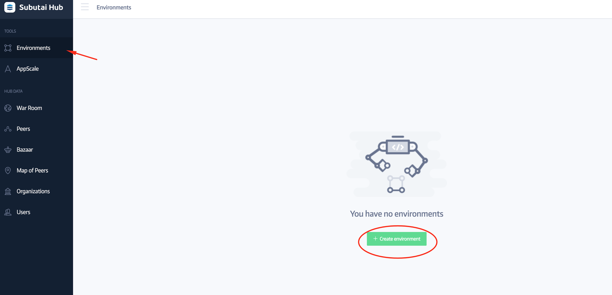{width="6.5in" height="3.138888888888889in"}

After, that, you will be redirected to the Peer selection page, where
you will see Peer(s) to be chosen for your Environment and what
resources (RAM, CPU, HDD) they have to offer. You can pick from: your
own Peers, favorites and ones shared with you by your friends.

Check your Peer(s) and press “next” button:

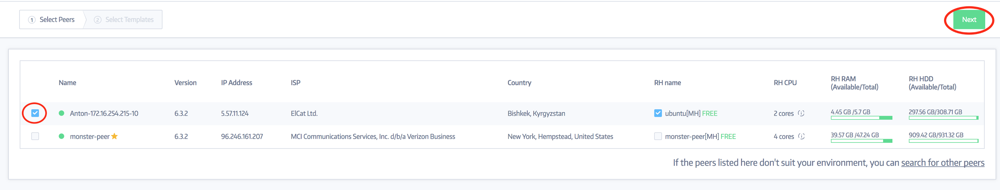{width="6.901042213473316in"
height="1.3541666666666667in"}

Then, you will be directed to the Template selection page. There you
will have option to choose system template(s) for your Environment.

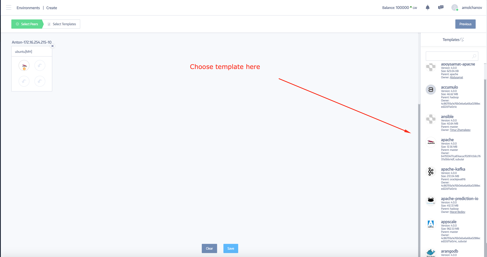{width="6.755208880139983in"
height="4.083333333333333in"}

Please note that you can add your own template and use it - you can do
this in the CDN menu.

You can also choose the size of your container - tiny, small, medium,
large or huge. And you can easily rename the container’s default name.
After you added the template(s) you want, click “save” button, select
the name for your environment, press “save” again and at the last step
press “build” button.

Next step you have is “under modification” state, which means that your
environment is being created. It make take some time before the
environment is built as some templates are big.

If all the steps are done properly, containers are built. You will see
“ready” in state field and your environment will be “healthy”:

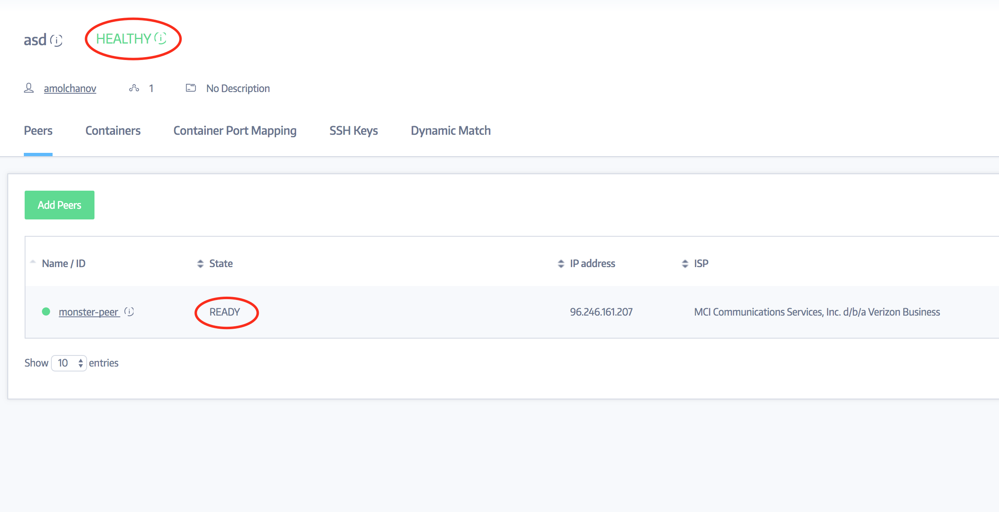{width="6.5in" height="3.3333333333333335in"}

So, now you have your environment and you are ready now to install
software you like there. Then, to make it accessible by a domain name,
please go to the “Container Port Mapping” page and press “Add new port”
button. There you can specify protocol, ports, domain name, proxy (if
it’s behind NAT) and pick container:

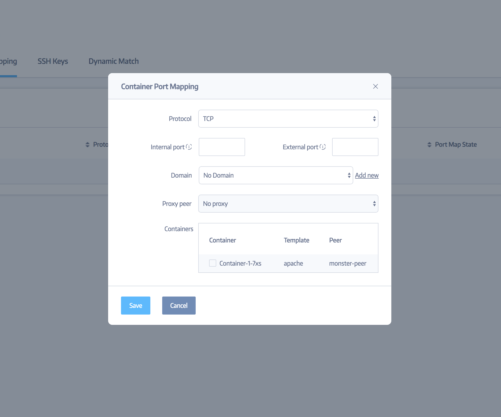{width="6.5in" height="5.416666666666667in"}

When all is ready, you will be able to access your container with
template by domain name.

This is how it should look like if you have properly configured port
mapping:

{width="6.901042213473316in"
height="2.5104166666666665in"}

And if you click your domain name, you will have your container (Apache
in the example) opened in browser under previously specified domain:

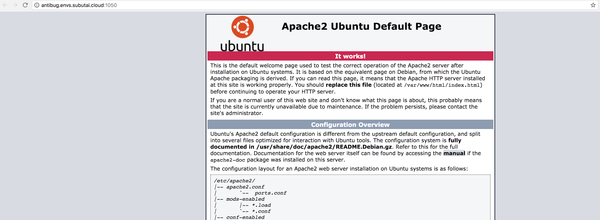{width="2.9791666666666665in"
height="2.7708333333333335in"}

Congrats! You are now ready to use your environment!

**What now?** You can access your environment straight from your
desktop! For this, you need to install and set up the following
components: Subutai P2P daemon and Subutai Control Center. After
installing them, please log into the Control Center using your Bazaar
website’s account. Then, to access your Environment, you need to
generate SSH keys, or add existing SSH keys to your environments:

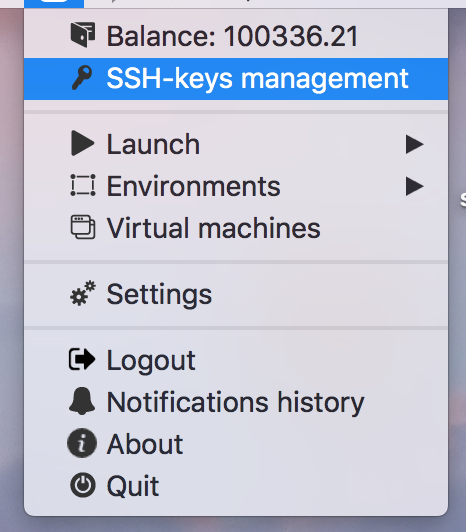{width="3.4739588801399823in"
height="3.3645833333333335in"}

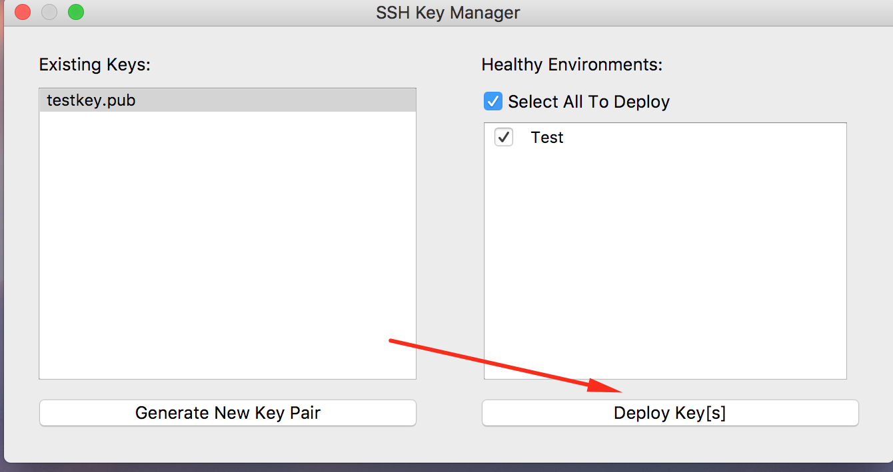{width="6.5in" height="3.4444444444444446in"}

So when all is up and running, you can SSH into your container via
Control Center, by opening its Environment menu, choosing the
environment you like and clicking it. You will see this:

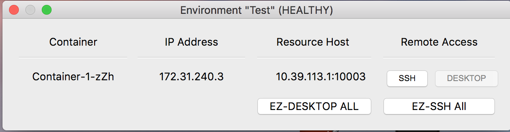{width="6.5in" height="1.6944444444444444in"}

Once your SSH button is active (white and clickable), you can click it
and then a terminal will be opened and you will have access to your
container!

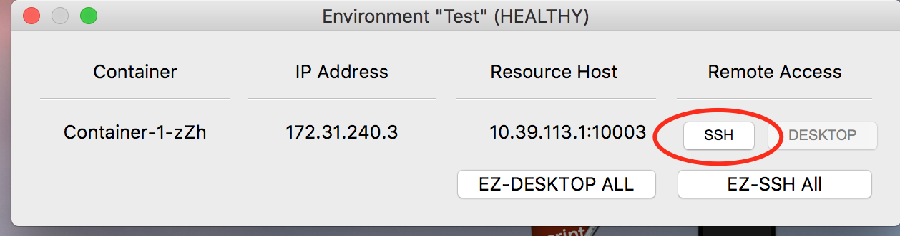{width="6.5in" height="1.7222222222222223in"}

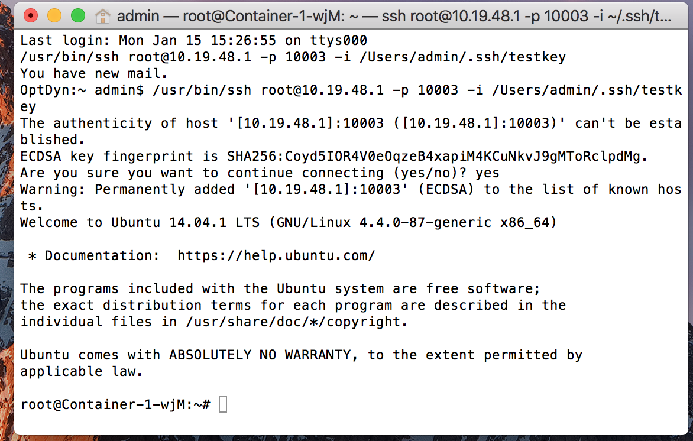{width="6.8085651793525805in"
height="4.807292213473316in"}

All plain and simple! Feel free to leave your questions or comments in
our [*slack community*](https://slack.subutai.io).
