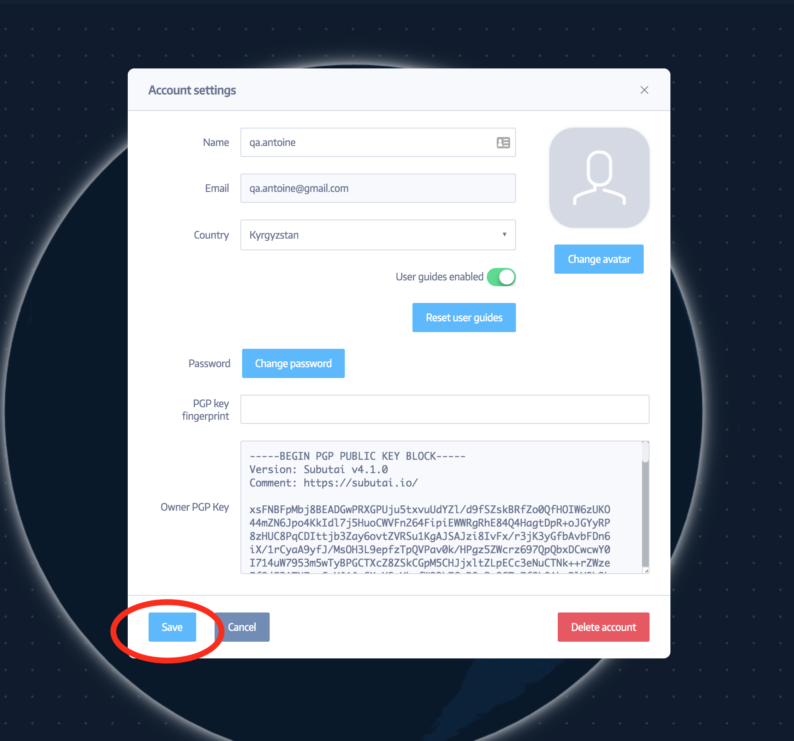

[*AppScale*](https://www.appscale.com/) is a special platform that can
automatically deploy Google App Engine applications on private or public
cloud systems. It can be deployed on local clusters as well. The main
idea of AppScale is to be a helpful platform for developers that can run
applications on any kind of cloud systems.

How to install AppScale to your environment?
--------------------------------------------

1.  First of all you need to create an Environment (link to
    > environment creation). You need to create 4 containers with the
    > AppScale template (this is very important, because each container
    > will be used to install specific parts required for AppScale’s
    > correct working) :

{width="2.5104166666666665in" height="2.34375in"}

2\. When the Environment is installed, on the left of its name a special
mark “A” is shown:

{width="6.057292213473316in"
height="0.5208333333333334in"}

3\. You need to click on AppScale “tool” on the left side of the
website’s page:

{width="1.3984656605424322in"
height="3.682292213473316in"}

4\. On the AppScale page you need to click the “Install Cluster” button.
Then you should select:

-   Environment’s name

-   Domain name (You will use it to access your
    > Appscale infrastructure). System will create port mapping.

Controller, AppEngine, Zookeeper and Database need to be filled: this is
why you created 4 containers with AppScale environments. You need to
select for each section uniq container, it should be used only once:

For Controller field choose Container 1

For AppEngine field choose Container 2

For Zookeeper field choose Container 3

For Database field choose Container 4

On the Email section you can type any valid email address(it will be
using like login).

On the final step you need to input and confirm new password. After push
“Save” button.

{width="5.208333333333333in"
height="5.979166666666667in"}

5\. You need to wait some time to finish the installation. When it is
finished, cluster status will show up as “INSTALLED”. After that you can
use your domain to get started with your applications!
