Follow these steps:

1.  First of all, you need to sign in to the Control Center application
    > by using your current login and password from Subutai Bazaar.

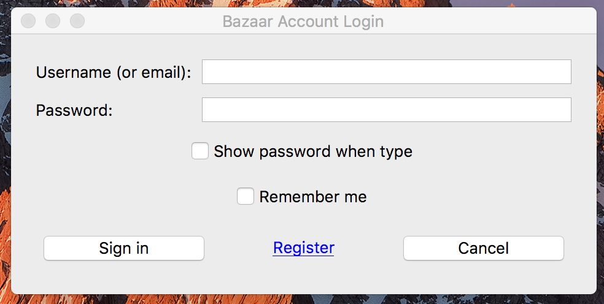{width="5.067708880139983in"
height="2.4053630796150482in"}

2\. When you have logged into your account, click the “Control Center”
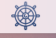{width="0.2708333333333333in"
height="0.2708333333333333in"} button on your task panel. The Control
Center menu will be open:

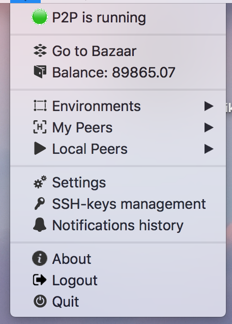{width="2.823846237970254in"
height="3.244792213473316in"}

The **status of your local P2P daemon** is shown on top. The P2P daemon
is needed in order to access your Peers and Environments, as well as
other operations on the Subutai Platform.

You can click the **Subutai Bazaar** button to access its website.

The **Balance** button shows your GoodWill -
([*https://subutai.io/goodwill.html*](https://subutai.io/goodwill.html))
balance. When you click it, you will be redirected to the Bazaar
website, and will be able to check your billing information.

**Peers** - will show your Peers, and offer some options:

1.  **Peer on Bazaar** button- After pushing this button, the Bazaar
    > website will be opened under your profile.

2.  **Launch Subutai Console** button - to directly connect to your
    > Peer’s console.

**Environments** Here you will see the list of all your current
Environments. After clicking the name of environment, you will see a
popup window:

**SSH** Here you can get access to a SSH connection to your environment:
it will open a command line, already logged in to your container. This
button allows users to easily connect with containers via SSH without
any additional actions.

**DESKTOP** By using this button you will be able to open the Desktop of
your Peer with a comfortable user interface, and work there as in any
PC. This service was created for comfortable access to containers and to
work with them using graphic interface. It will only work on
Environments running a graphic user interface.

If you have several containers, you can get fast access to all of them
by using “Desktop All” or “SSH All” buttons. Here also you need to have
deployed SSH keys for access to your containers.

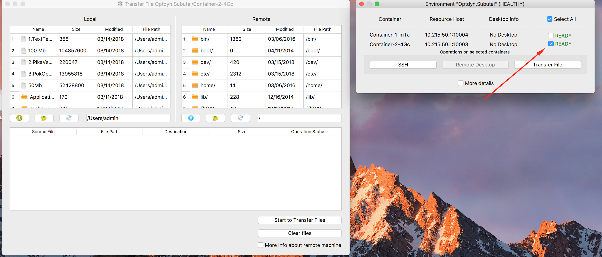{width="6.5in" height="2.7777777777777777in"}

**Transfer File** - Transfer and srote any type of file to and from your
containers. Click the button and a new window will appear, divided in
two parts: 1. Local directory (users/admin path by default); 2. Remote
container’s directory (root path). There you can see some buttons:
upload to remote container, switch directory, refresh directory.
Download from remote container, switch directory, refresh directory.

**Local Peers** - If you installed a Peer on the same computer where the
Control Center is running, you can access it here.

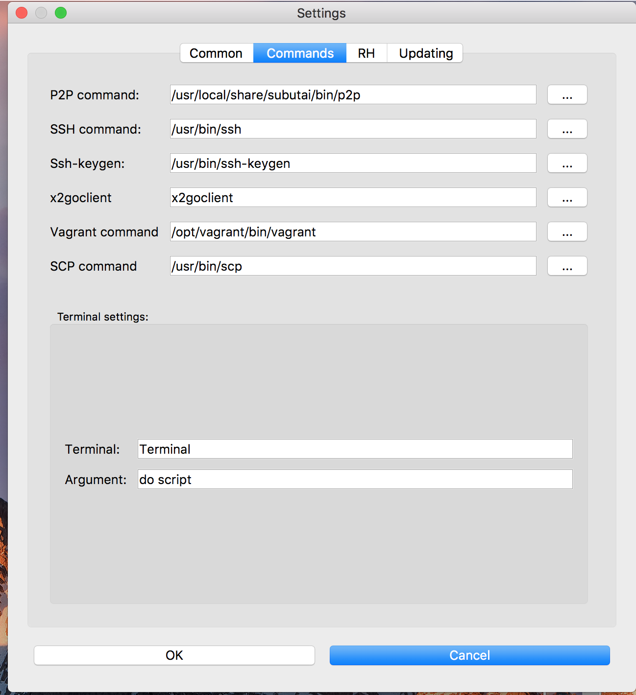{width="6.5in" height="7.111111111111111in"}

**Settings** - Here you can see several tabs: Common, Commands, RH,
Updating.

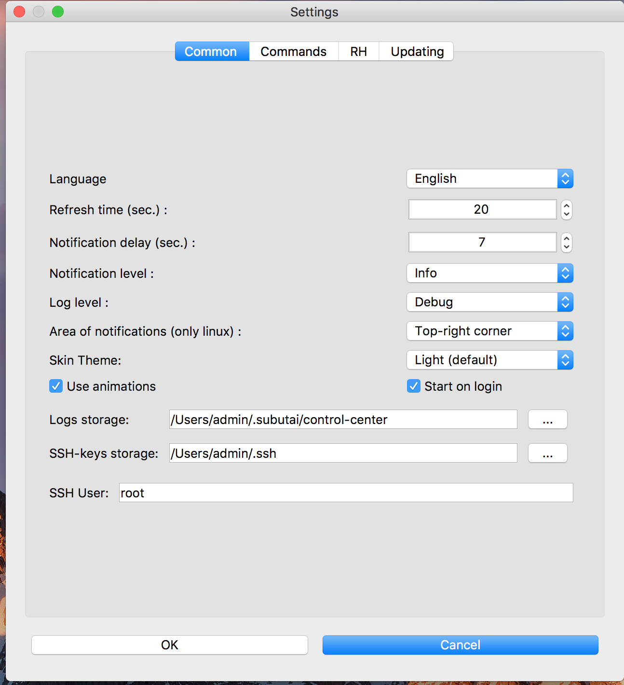{width="5.697916666666667in"
height="6.252737314085739in"}

**Common** tab - Here you will be able to choose Language, setup Refresh
time, Notification delay (in seconds), notification and log levels. Also
here you can see and change the location of logs and SSH-keys in your
system.

**Commands** tab - Here you can define the path to the binaries of p2p
daemon, SSH client, ssh-keygen, x2go client.

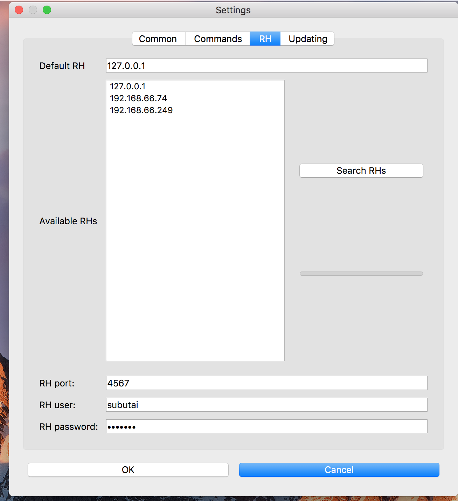{width="6.5in" height="7.111111111111111in"}

**RH** (Resource Host) tab - In this tab you can add and choose the IP
addresses of other Peers. Here also you can select the IP address of the
Peer you want to use by default. RH port - this is the port of the
Resource Host. RH user - name of user on Resource Host, which was
informed when you were registering your Peer on the Subutai Bazaar.
RH-password is the password from your Peer. Here you can search
available Peers.

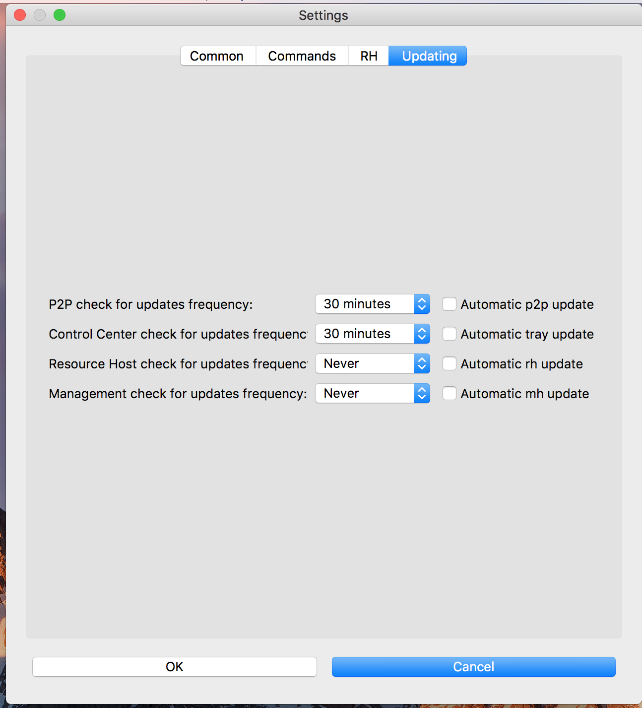{width="6.5in" height="7.166666666666667in"}

**Updating** tab - Here you can set up the time interval to check for
updates of p2p daemon, Subutai Control Center, Resource Host,
Management.

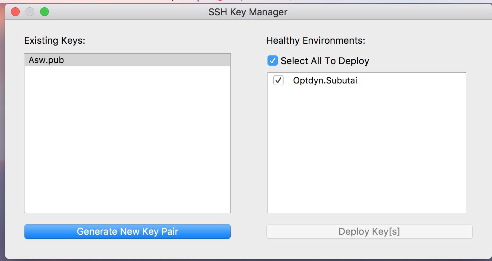{width="6.5in" height="3.4444444444444446in"}

**SSH Key Manager** - Here you can generate SSH keys to guarantee a
secure connection with your Environments. To do it, you need to choose
the desired Environment and click on “Generate New Key Pair” button.
After this, a dialog window will be opened and you will be able to
inform a name and the directory where this key should be saved. Then you
need to mark the checkbox near the name of the key and the name of
Environment and click “Deploy keys” button. The Key will be saved in the
Environment. It can take some moments. Don’t forget that deploying SSH
keys is mandatory if you want to access your enviromnent remotely.

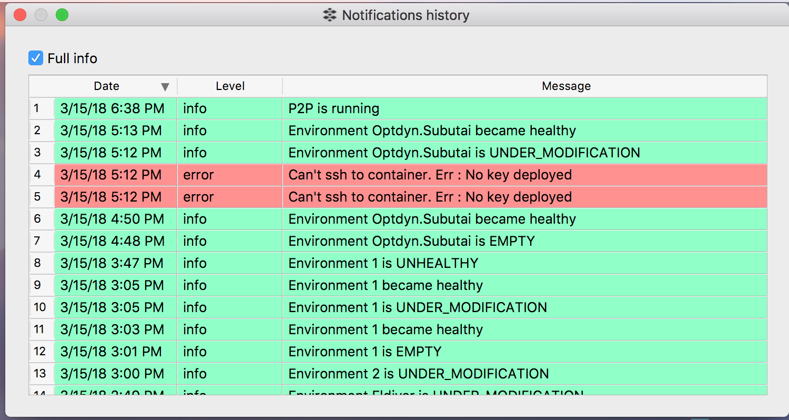{width="6.5in" height="3.4583333333333335in"}

**Notifications history** - By clicking this button you are able to see
all notifications from the system.

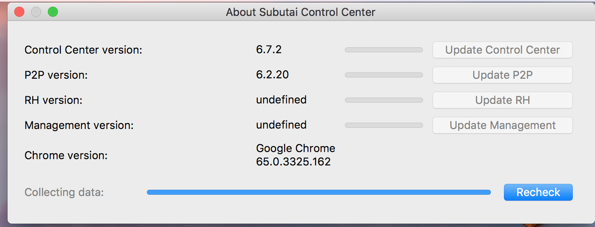{width="6.5in" height="2.486111111111111in"}

**About** - Here you can check the current versions of Control Center,
p2p daemon, Resource Host, Management, VBox. Also here you can check
updates for your applications. If they are available you can update them
by using corresponding button.

**Logout** - When you click this button, you are logged out of Subutai.
You can use it to change accounts, or be redirected to the Bazaar
website to register a new account.

**Quit** - Close the application.
