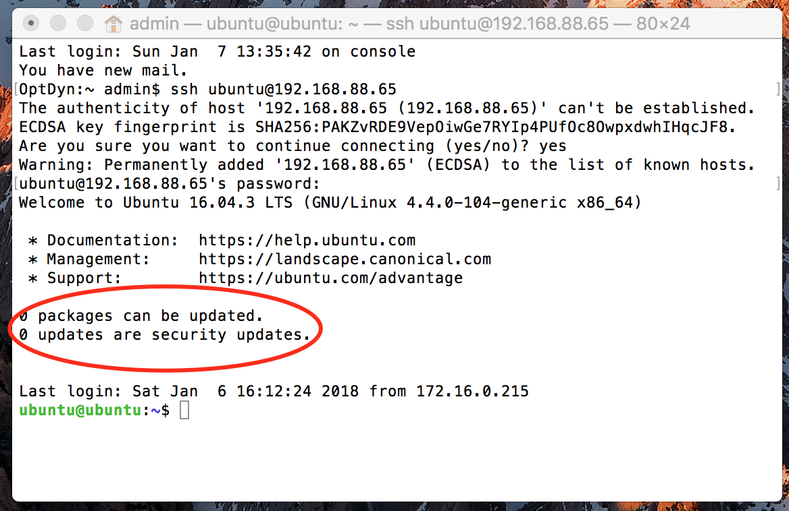
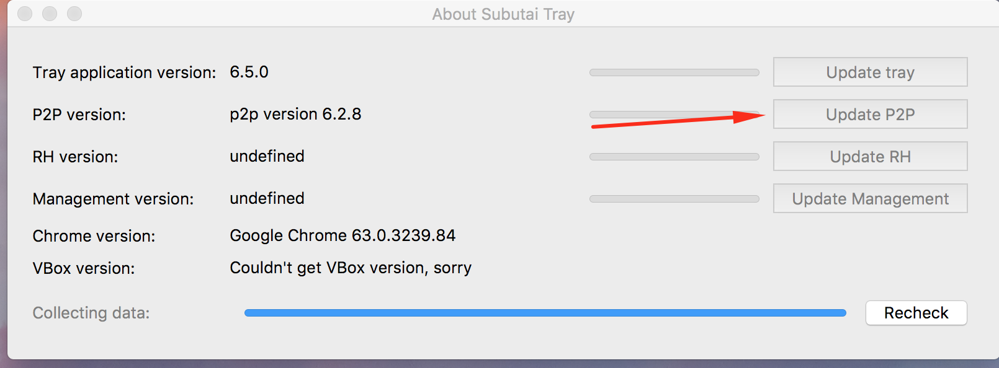
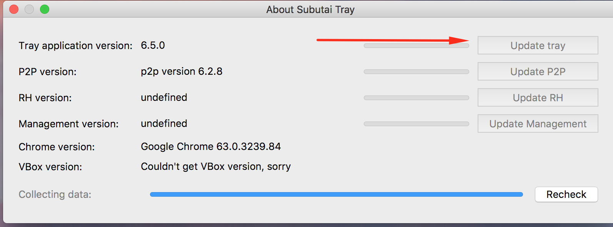

In order to prevent damages to your system and the whole Subutai
ecosystem, please keep your software always up to date. The following
instructions will help you update all components of Subutai Platform.

Regular updates:
----------------

1.  To update the Subutai Console, login to your peer’s console, go to
    > the “System” menu and press “Updates”, then press “Check” button.
    > If your system doesn’t require an update, you will see this
    > message - “Your system is already up-to-date”, and if it needs to
    > be updated, you’ll see this message - “Update is available”.

2.  To update your Resource Host through the CLI
    > (command-line interface) terminal, open the CLI on your machine,
    > connect to your peer with SSH (please don’t forget that you need
    > to have established and protected your connection and SSH key
    > setup for this). Once you have connected to the peer, execute the
    > following command: ‘sudo subutai update rh’ . After some moments,
    > your system will be updated. When it’s up-to-date, you will see
    > the following message: “No update is available”.

3.  To update your Resource Host management, please use the following
    > command: ‘sudo subutai update management’

4.  To update packages inside your peer (if it’s required), please
    > execute the following command: ‘sudo apt-get dist-upgrade’

{width="5.453125546806649in"
height="3.530731627296588in"}

Other updates:
--------------

### Update P2P daemon:

To update the P2P daemon using your Control Center desktop app, log into
it using your Subutai Bazaar account, then click “About” menu and press
“update p2p” if it requires updates.

{width="6.5in" height="2.4027777777777777in"}

### Control Center update:

To update the Control Center desktop app, log in to it using your
Subutai Bazaar account, then go to “About” menu and press “update
Control Center” if it requires updates.

{width="6.5in" height="2.4166666666666665in"}

### RH update in Control Center:

To perform RH update in Control Center desktop app, log in to it, using
subutai Bazaar account, then go to “About” menu and press “update RH” if
it requires updates.
