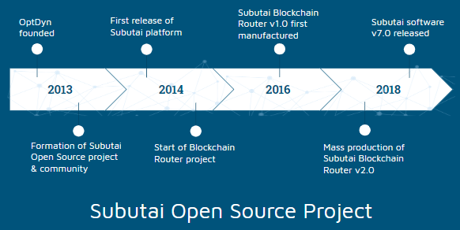

In 2013, [OptDyn](https://optdyn.com) was founded to start the Subutai Open Source Project, which aimed at creating a peer-to-peer (P2P) cloud and fog computing platform called Subutai. What followed were software and hardware products built to improve and enhance the Subutai ecosystem. 

The Subutai Software and Subutai Router hardware are both 100% free and open, using the Apache Software License v2.0 and GPL licenses respectively.

Find out the various ways of getting involved with the project:
* [Contribute to the Subutai Cloud](#contribute)
* [Earn GoodWill](#goodwill)
* [Join the Community](#community)

###  Contribute to the Subutai Cloud

_There are many ways to contribute to the Subutai crowd cloud or, shall we say, many ways to join the horde!_

**Start using Subutai.** Use Subutai to start renting or sharing your computing resources. With the PeerOS, you can create peers and fire them up using Subutai Vagrant boxes. Once up and running, register them with the Bazaar where other users and renters can select them according to their requirements.

For those wanting to host their applications choose from available peers, and start installing applications on them. Several open source applications can be readily installed and set up in no time. If you want, you can also host them on your own peer to gain access online from anywhere. This alone will feel empowering.  

**Give feedback.** We welcome your feedback! Tell us how we can improve the user experience for everyone. Your helpful feedback, suggestions, and comments are extremely valuable to us. Plus, we want to light up that globe at [Subutai Bazaar](https://bazaar.subutai.io). With peers all around the world, the power of the P2P cloud community increases. Connect with us on [Subutai Slack](https://slack.subutai.io) to contribute or discuss your ideas.

 

**Help grow the P2P cloud sharing economy.** The sharing economy is always evolving. Join us in building an economy around GoodWill, a digital asset generated by good deeds that improve the participant experience on the platform.

And recently, after upgrading GoodWill to an on-chain ERC20 token you can also purchase GoodWill. See the [GoodWill page](https://goodwill.subutai.io) to purchase tokens via credit card, PayPal, and with various cryptocurrencies.

**Contribute Blueprints.** One-click cloud application installation is critical. Users from all walks of life should be able to launch an application in their own cloud, with the same ease in which they install an iPhone application from the AppStore. Bridging this gap between non-technical users and open source products is crucial for the success of open source in the cloud era. Subutai Blueprints were designed to make open source cloud applications easy to install and use for mass consumption.

For developers, a Blueprint is a simple JSON based templating format. Use blueprints to fire up application stacks within environments or build environments using your favorite DevOps tools for automation. Subutai Blueprints support Ansible and other tools out of the box. Contributors who create blueprints that are made freely available on Bazaar may qualify for GoodWill promotions. *[Get started today!](../../working-with-subutai/blueprints/create-blueprints)*

**Get involved.** Developers and engineers are welcome to contribute! We need Ethereum blockchain and Solidity savvy engineers, P2P researchers to help us experiment and optimize DHT and Gossip protocols. We need C/C++, Java, Javascript, Golang programmers. If you want to get involved as a developer, first *[give Subutai a try](../../working-with-subutai/getting-started)* as a user. Then, take a look at our list of *[GitHub projects](https://github.com/subutai-io/)* to get an idea of which area you could focus on. Come onto our *[Slack channel](https://slack.subutai.io)* and let us know if you need help diving in. We’re here and waiting for you! Register on the *[Subutai Bazaar](https://bazaar.subutai.io/)*, and we’ll give you some GoodWill to trade cloud resources with others on the system.

###  Get GoodWill

As mentioned before, you can purchase GoodWill [here](https://goodwill.subutai.io) via credit card, PayPal, and with various cryptocurrencies.

You can also earn GoodWill from other users by renting your idle compute resources to them. This requires setting up a peer. See the [PeerOS Quick Install](https://docs.subutai.io/working-with-subutai/using-peeros/peeros-quick-install) to rapidly set up your own peer.

Rewards and bounties exist for collecting GoodWill as you use the application. The Bazaar even gives you GoodWill when you create your first cloud environment or submit a Blueprint.

There's also a special initiative to additionally reward those who help provide resources to open source projects. See [Helping Spread GoodWill](https://subutai.io/subutai-foss.html) for more details.  

###  Join the Community

Join our social media channels to get updates on the latest release, news, and activities:

* <a href="https://slack.subutai.io">Slack</a>
* <a href="https://twitter.com/Subutai_KHAN"> Twitter</a>
* <a href="https://www.reddit.com/r/SubutaiKHAN/"> Reddit</a>
* <a href="https://www.linkedin.com/company/subutai-social-cloud/"> LinkedIn</a>
* <a href="https://www.facebook.com/SubutaiKHAN/"> Facebook</a> 
* <a href="https://t.me/SubutaiKHAN">Telegram</a>
