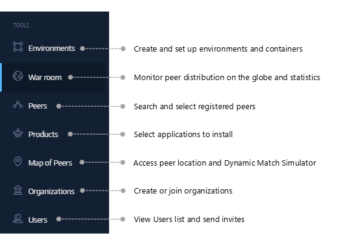
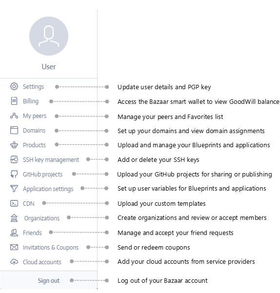
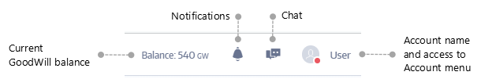

## Get to Know Subutai Bazaar
The features and functionalities in Bazaar are organized in two main menus: Tools and Account.

### Tools menu
Access Bazaar features such as peer selection, creation of environments, application installation, and peer tracking.

### Account menu
Options on the Accounts menu provide access to tools for updating and managing your Bazaar account, including components that you own or create, like domains, SSH keys, applications, projects, and organizations.

### Account bar
At the top right corner is the Account bar with the following controls:

Usage instructions and guidelines for these tools and controls are provided in the succeeding topics of this section.
