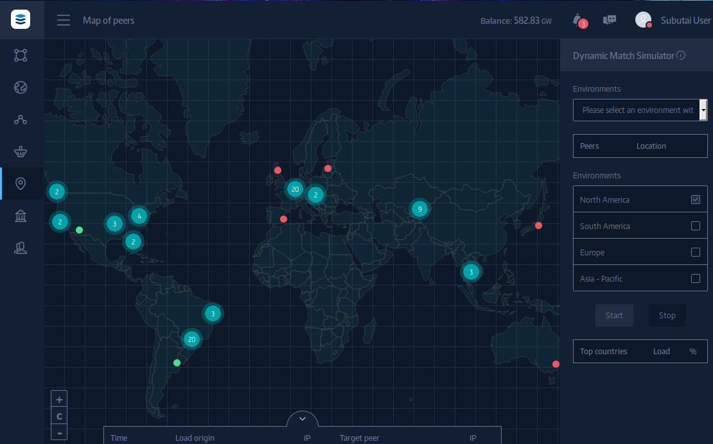

The Map of Peers is a tool where you can oversee all Subutai Bazaar Peers over the world. After adjusting its dynamic match settings, you can also watch the simulation of how your environment would react on load requests (make sure you enable Dynamic Match on your [Environment page](../environments))

