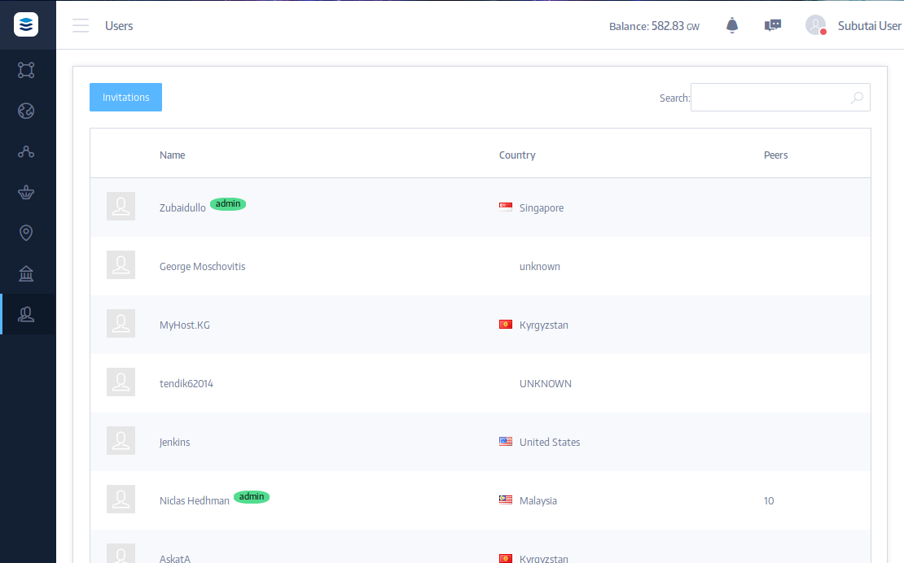

Search, connect, and start chatting with colleagues, friends and fellow horde members around the world. You can also invite new users by sending them invitation tickets which contain a personal code. You can see a list of receivers of tickets, their personal code, date of registration, and status. Every user that you invite will be displayed in the Invitation tree. Clicking your username will open the Billing section that contains a journal of transactions, environments payment reports, and rewards.