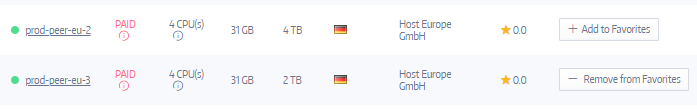

### Select Peers
Whether buying, renting, or sharing peers, use Subutai Bazaar to find compute resources that you need. Resources are made available through peers or virtual nodes. Peers that are registered with Bazaar can be available as:

* **Paid** - peers available for rent to all users
* **Free** - peers available to all users for free
* **Shared** - peers shared to select users

### Pricing of Paid Peers - Container Size

Pricing of the paid Peers is defined in [GoodWill](../../../../glossary#good-will) per hour, according to the desired size of the containers. The platform has preset container types:

| Type | RAM | DISK | CPU |
| ---- | --- | ---- | --- |
|TINY|256M|4G|10%|
|SMALL|512M|10G|25%|
|MEDIUM|1024M|20G|50%|
|LARGE|2048M|40G|75%|
|HUGE|4096M|100G|100%|

> `Disk` and `RAM` are self-explanatory. `CPU` is the percentage that the container is allowed to consume with all cores on the machine it runs on.

Current market prices can be checked on the right sidebar of the War Room page of the [Subutai Bazaar](https://bazaar.subutai.io).

####  Search for peers
Use the Search tool on the Peers page to look for a peer by its partial or full name. You can also use the filters at the top of the page to narrow down the list of peers.

* **Country** - Select from the list of countries where available peers are located.
* **CPU** - Select from the list of CPUs used by peers.
* **ISP** - Select from the list of ISPs associated with existing peers.
* **Price** (/hr) - Enter the minimum and maximum range for price per hour, in GoodWill.
* **Memory** - Adjust the scale to specify the range (between 0 and the maximum available in Bazaar at the time).
* **Disk** - Adjust the scale to specify the range (between 10 GB and the maximum available in Bazaar at the time).

Other search options include the following:
* **Including offline peers** - Add offline peers to the list.   
   💡 You can add offline peers to your Favorites list, but you cannot set them up with an environment or application until they become online.

#### Add peers to Favorites
From the list on the Peers page, select each peer by clicking **Add to Favorites**. 

To view your Favorites list, click **My Peers**, and then go to the Favorites tab. 

Take note of the following key points when adding peers:

* Before adding a peer, review its details to verify that it suits your requirements. Details tagged with the Info icon, including price and CPU, display more information when you hover over them. To refine the list of peers, see Search for peers.
* You can add offline peers or those that are not updated to your list; however, you cannot use them for your environments and applications until they become online,  active, or updated.
* When adding Free peers, be aware that they can be changed to Paid by the owner, and vice versa.

After adding peers to your Favorites, you can select any of them to create environments and install applications using blueprints. 
