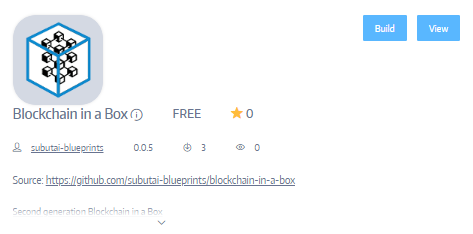
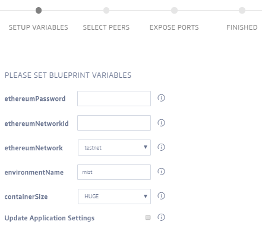

### Use Products or Blueprints
Install blueprints or your products on peers that you own or rent. To install applications using a Subutai blueprint, go to the Application Blueprints tab. To know more about blueprints, see [Use Blueprints](../../blueprints).

#### Search for blueprints or products
On the Products page, you can search for blueprints or other products to install on peers. On the Application Blueprints or My Products tab, enter the full or partial name of the blueprint on the Search box. 

✔️ If you do not see your blueprint or product on the page, verify that it has been published. 

#### Install blueprints or products
Blueprints are installed on peers that you own, share, or rent from other users. If you are using a Paid peer, the rent starts after the environment is built. 

Before installing a blueprint, be sure that you have added peers to your Favorites list. For instructions, see [Select Peers](select-peers).  

To install blueprints or products:

1. From the Application Blueprints or My Products tab, select the application that you want to use.   
   The following steps and screenshots are taken from the Blockchain in a Box blueprint.      
   ✔️ On the product’s specific page, you can view more details about the application. On a blueprint’s page, click View to review the code. 
2. Click **Build** to open the Blueprint Wizard.   

   
3. Fill out the form on each tab.      
   💡 Form details and tabs vary depending on the requirements to install and configure an application.   
   
   
4. After filling out all required fields, click **Start** or **Next** to proceed to succeeding tabs.
5. When you reach the last tab, click **Finish** to start the build.   
   Remember that it takes a while to complete an installation, especially for big applications. 

#### Take a look at our featured blueprints

The following blogs provide more information about our featured blueprints:

* [Welcome Blockchain-in-a-Box, the latest addition to the Subutai family of blueprints!](https://subutai.blog/2018/03/13/welcome-blockchain-in-a-box-the-latest-addition-to-the-subutai-family-of-blueprints/)
* [Introducing the IoT Sandbox Blueprint](https://subutai.blog/2018/10/04/edge-iot-solutions-powered-by-subutai/)
* [Deploying GitLab Through Subutai: the quick and easy way](https://subutai.blog/2018/06/07/deploying-gitlab-through-subutai-the-quick-easy-way/)
* [Conquer the Cloud with Subutai Blueprints: Nextcloud – easy, flexible, secure cloud storage](https://subutai.blog/2018/07/05/conquer-the-cloud-with-subutai-blueprints-nextcloud-easy-flexible-secure-cloud-storage/)
