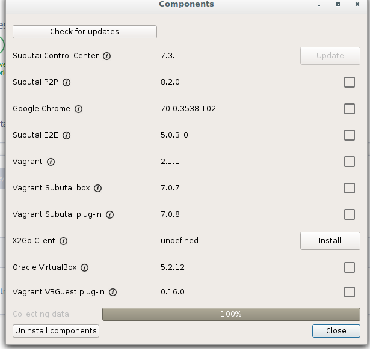
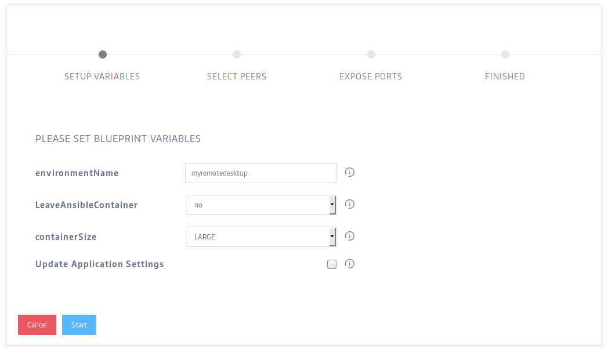
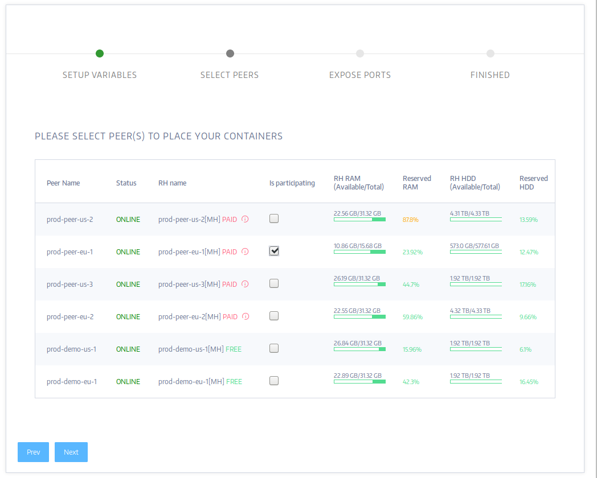
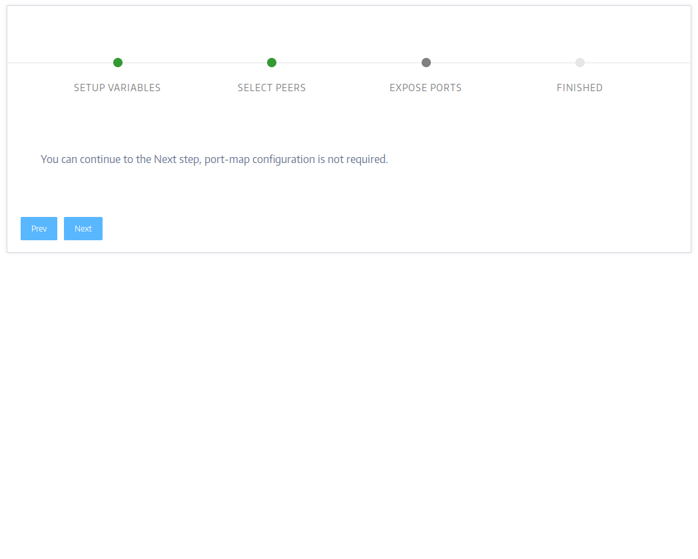
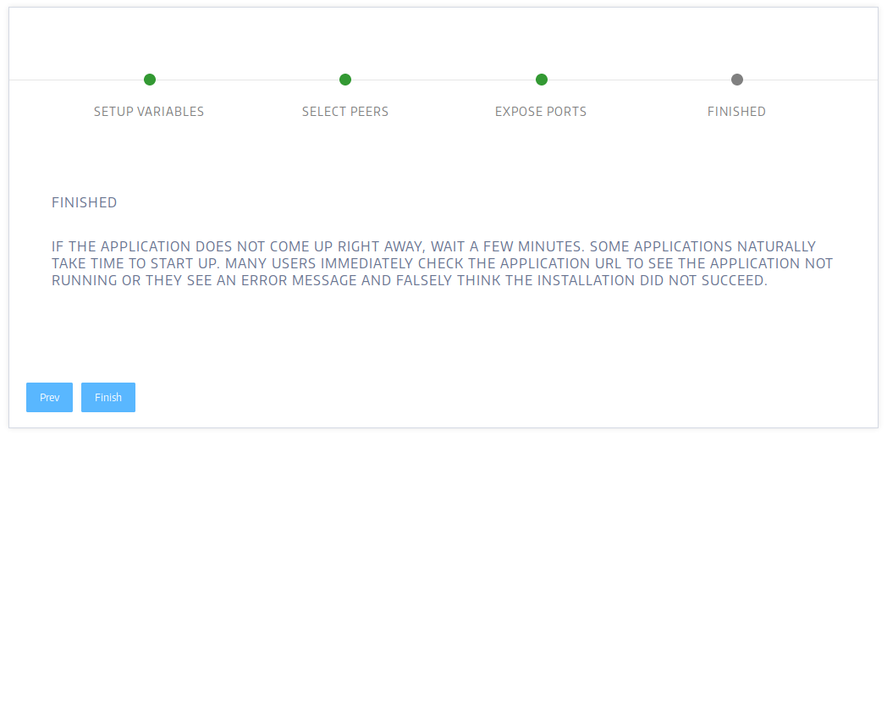
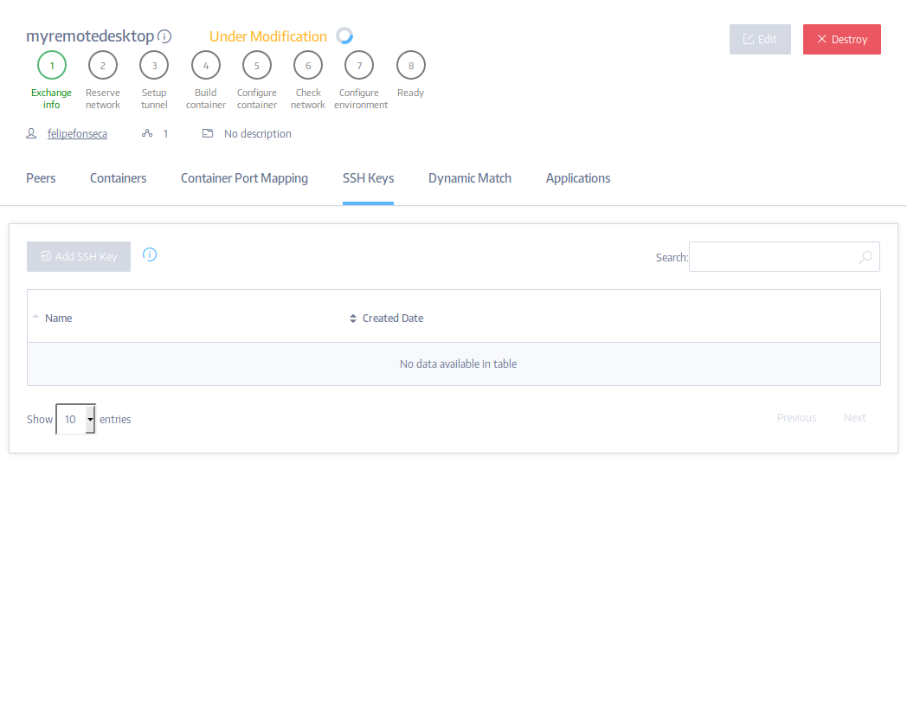
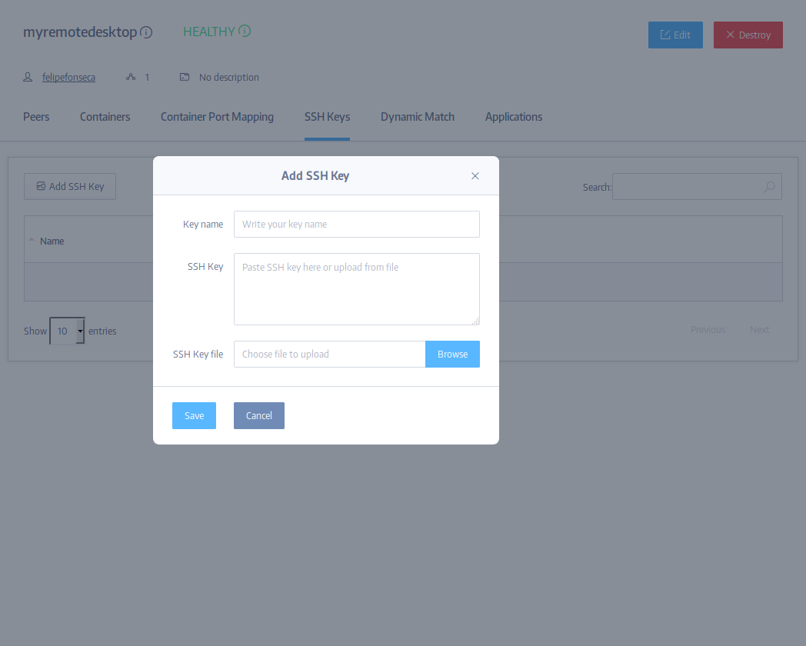
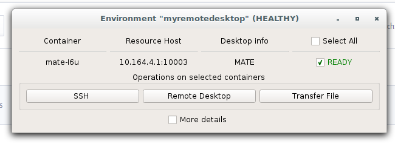
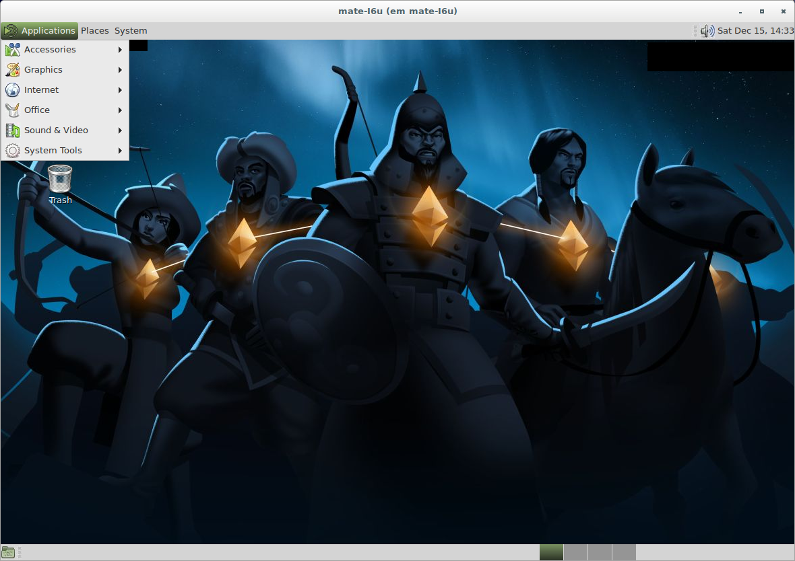

One of the most exciting features of Subutai is the ability to run complete remote desktop environments on P2P cloud containers. By using X2Go integrated with the [Subutai Control Center](../../../../software-components/control-center), you can easily access a graphical user interface (MATE desktop environment) to install and run applications remotely in a Debian container.

!! Before running the Blueprint, make sure you have added your SSH key to Subutai Control Center and installed the X2Go client from its "components" section; and added at least one Peer to your Favorites List (or registered your own Peer in the Bazaar).

1. To start installing your remote desktop environment, access the [Products page](https://bazaar.subutai.io/products) in Subutai Bazaar. Click the Mate2Go icon, then click "build".

2. Insert your variables:

- environmentName - how you want to name this environment.
- LeaveAnsibleContainer - in order to run the Blueprint, Subutai creates a container that will execute a script installing all the needed software. It is safe to delete this container afterwards, so in most cases you will keep the default option ("no").2
- containerSize - this Application requires a2 lot of disk space, so we recommend you to use the LARGE or HUGE sizes. 
- Update Application Settings - tick this checkbox if you want the variables you just inserted to be saved as the default options for this Blueprint.

3. Select the Peer where you want to install the Application.

4. As this Blueprint does not need port mapping by default, you can safely skip the next screen.

5. You have finished the set up. Click Finish to start building your remote environment.

6. As this is a complex application that requires a lot of software to be installed, the build process can take a while - depending on the Peer selected. You can follow its status on this page. 

!! Congratulations, you have set up and built your remote desktop environment!

7. As soon as the environment is built, add your SSH key to it. You can either use Subutai Control Center to do that that, or add it straight from the "SSH Keys" tab in the Environment's page on Subutai Bazaar as shown below.

8. Now it is time to access your remote desktop! Open Subutai Control Center, click the Environments tab and choose your Environment. Then click the "Remote Desktop" button on it.

9. As it is the first time you access your remote desktop, X2Go will ask you to confirm you trust it. Click "yes". The window will disappear and you need to wait for some seconds before X2go starts again, automatically.

10. Now you have a full-fledged Mate desktop running on Debian Stretch inside a P2P remote container. Explore all the possibilities of the software installed by default, and expand it with virtually anything that can run on Debian using tools such as apt, dpkg and Synaptic.

