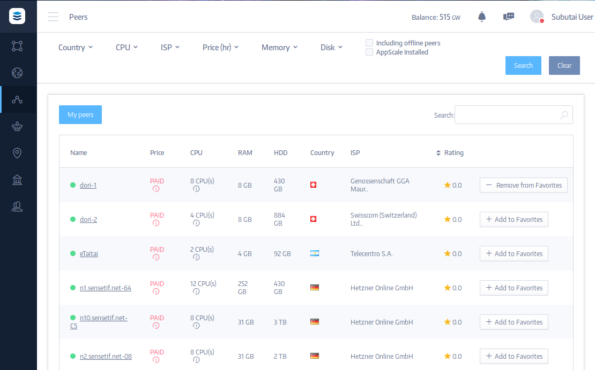
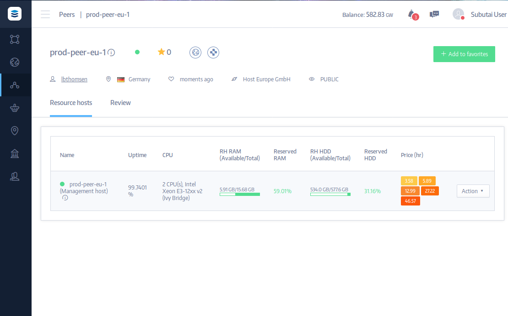

[TOC]

A Peer is a single Subutai node with management services (a management host container), and at least one local Resource Host that contribute resources to be shared.

### List of Peers

Here you can see the list of all online and offline existing Peers. The following information about Peers is available:

- Peer’s name.
- Price of using the Peer (per hour, in GoodWill).
- Information about CPU: quantity and type of cores, frequency of the processor, manufacturer of processor.
- Information about RAM (random access memory) in GB (Gigabyte)
- Information about volume of hard disk in GB.
- Country where the Peer is located.
- Internet service provider (ISP).
- Rating of Peer.
- Status of Peer. Here you can add the Peer to your list of Favorite Peers, which can be used to create [Environments](../environments) later. You can also remove Peers from your favorite Peers list.

Also, you can sort Peers using the options on the top. And you can click the “My Peers” button to see all the Peers you own.

### Individual Peer page

On the individual Peer page you can see useful information:

- Username of the Peer’s owner.
- Location of the Peer.
- Last heartbeat. This is the last ping (test reachability of host) > from the Peer, which shows that the Peer is online.
- Name of the Peer’s internet provider.
- Scope. Peer can be public (visible for everyone) or Private (visible > only for its owner).
- See this Peer in the War Room.
- Access this Peer via Subutai Console (if you have the proper rights and credentials)
- On the top right corner you can add or remove to/from your list of favorite peers.

There is also information about the [Resource Host](../../../../glossary#resource-hosts-r-hs):

- Name of Resource Host,
- Resource Host ID (RH ID),
- IP address of Resource Host (RH IP),
- Resource Host version (RH version),
- P2P version,
- Uptime in %. This is total % of time this Peer is online.

If it's your Peer, you can click the "Action" button for more options: see metrics, change prices, logs and others.
