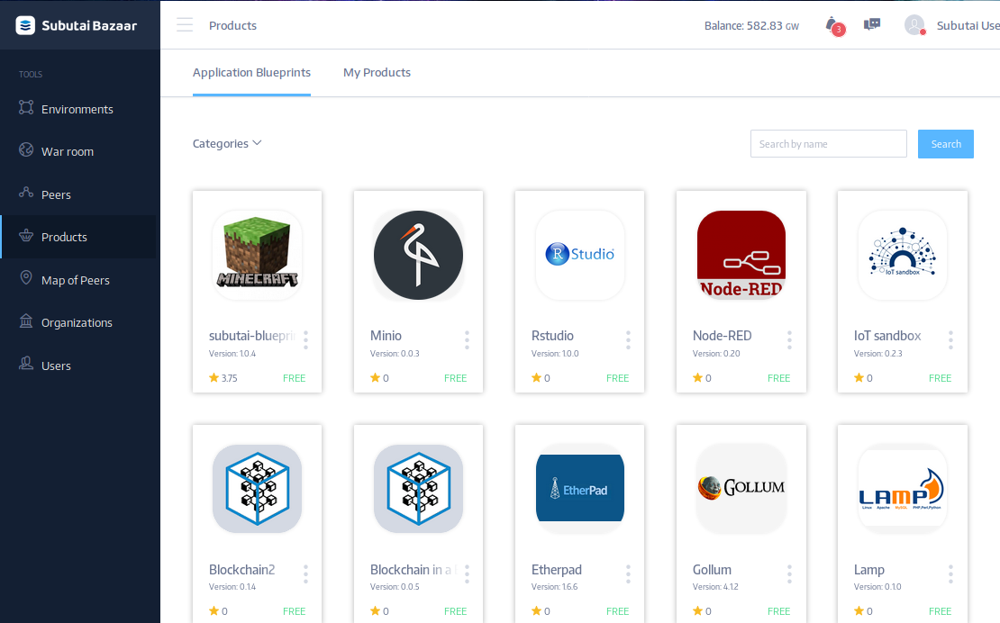

The Subutai Bazaar has a special section named “Products”. Here you can choose a lot of different applications, which can be installed on any users’ Environments to run a variety of web and cloud applications. Products are based on [Subutai Blueprints](../../../blueprints).

From the products page you can choose any product by clicking on it. You will be able to see a description, version, size, owner, quantity of views and installs, price, and other information about the product. You also can leave your own review and rate it.

There is an install button on the top right. You can click this button, and follow the instructions to install the product in a Peer or group of peers. [Learn more](../../../blueprints/using-blueprints) about how to run Blueprints to install applications.

### Adding your own Products.

In order to add your own Blueprints to the Products page, follow the instructions provided [here](../../use-account-tools#my-blueprints).
