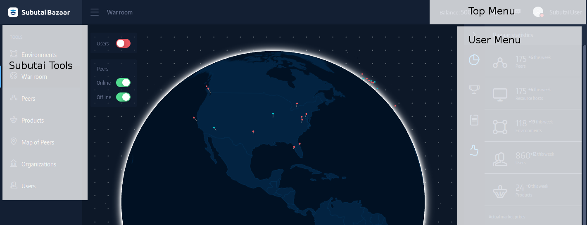

## Using Bazaar

In this section, peer owners and users can find out how to create a Subutai Bazaar account and use its features.

* **[The Subutai Bazaar: An Overview](#bazaar-overview)**
* **[Get to Know Subutai Bazaar](get-to-know)**
* **[Quick Start for Subutai Bazaar](bazaar-quick-start)**
* **[Use the Bazaar Tools](using-bazaar-tools)**
* **[Use the Bazaar Account Tools](use-account-tools)**

***

###  Subutai Bazaar: An Overview

#### What is it?

This global marketplace enables users to sell, rent, or trade compute resources and applications online. Commonly described as “the Airbnb of cloud and IoT computing resources”, Subutai Bazaar serves as a blockchain-based resource and device commodity exchange.

#### Key features

* Management and listing of Subutai Blueprints and applications
* Environment management that includes peer and template selection, container configuration, and environment telemetry, among others
* Search and selection of peers manually or automatically through intelligent analytics
* Access to operator management console for peers and their environments and containers
* Management of domain name assignments
* Setup and management of organizations for collaboration on projects and resource sharing among members
* Subutai Control Center and E2E plugin integration

#### Get started

For peer users:
<table>
 <tr rowspan="2" align="center"> 
  <td> <a href="https://github.com/subutai-io/documentation/wiki/Quick-Start-for-Bazaar"> Create a Subutai   Bazaar Account </a>
  </td>
  <td>➭</td>
  <td> <a href="https://github.com/subutai-io/documentation/wiki/Select-Peers"> Select Peers </a>
  </td> 
  <td>➭</td>
  <td> <a href="https://github.com/subutai-io/documentation/blob/dev/user/pages/02.working-with-subutai/06.using-bazaar/03.using-bazaar-tools/02.use-products-blueprints/docs.md"> Use Blueprints </a> or   <a href="https://github.com/subutai-io/documentation/blob/dev/user/pages/02.working-with-subutai/06.using-bazaar/03.using-bazaar-tools/03.create-environments/docs.md"> Create Environments </a>
  </td> 
 </tr>
</table>

For peer owners, operators, or administrators:
<table>
 <tr rowspan="2" align="center">
  <td> <a href="https://github.com/subutai-io/documentation/blob/dev/user/pages/02.working-with-subutai/06.using-bazaar/02.bazaar-quick-start/docs.md"> Create a Subutai   Bazaar Account </a> 
  </td>
  <td>➭</td>
  <td> <a href="https://github.com/subutai-io/documentation/blob/dev/user/pages/03.software-components/01.e2e-plugin/docs.md">Install   E2E Plugin </a>
  </td>
  <td>➭</td>
  <td> View Your   Registered Peers
  </td>
 </tr>
</table>

<!--[Subutai Bazaar](https://bazaar.subutai.io) is the P2P cloud market and social environment for the
Subutai Platform. These documentation pages have instructions on what it
can do and how. Through the Bazaar users can sell, barter, share or hire
computational resources and server applications from other users.
 The Bazaar congregates Peers provided by the community of users running
Subutai PeerOS. Anyone can create Environments on these Peers, based on
diverse templates that range from simple containerized linux servers to
more complex applications such as Cassandra, Apache, Wordpress, Jetty or
even a full-fledged GNU-Linux Operating System with a Graphic User
Interface.
###Sign up
Sign up to the Bazaar by accessing the [register page](https://bazaar.subutai.io/register). You can either inform your e-mail and click "Sign up", or choose one of the options of external authentication (Facebook, Google or GitHub).
[plugin:youtube](https://www.youtube.com/watch?v=70BsnBbT-YQ)
###Bazaar Interface
 Bazaar's user interface is organized around three menus. The top menu provides access to communication and status tools. THe right sidebar shows the User menu and contextual information, and the left one leads to the Bazaar tools.

- [Top menu](top-menu)
  - [Balance](top-menu#balance)
  - [Notifications](top-menu#notifications)
  - [Chat](top-menu#chat)
  - [User profile](top-menu#user-profile)
- [User menu](user-menu)
  - [Settings](user-menu#settings)
  - [Billing](user-menu#billing)
  - [My peers](user-menu#my-peers)
  - [Domains](user-menu#domains)
  - [Products](user-menu#products)
  - [SSH key management](user-menu#ssh-key-management)
  - [My Blueprints](user-menu#my-blueprints)
  - [Application settings](user-menu#application-settings)
  - [CDN](user-menu#cdn)
  - [Organizations](user-menu#organizations)
  - [Friends](user-menu#friends)
  - [Invitations & Coupons](user-menu#invitations-coupons)
  - [Cloud accounts](user-menu#cloud-accounts)
- [Bazaar tools](bazaar-tools)
  - [Environments](bazaar-tools/environments)
  - [War Room](bazaar-tools/war-room)
  - [Peers](bazaar-tools/peers)
  - [Products](bazaar-tools/products)
  - [Map of Peers](bazaar-tools/map-of-peers)
  - [Organizations](bazaar-tools/organizations)
  - [Users](bazaar-tools/users)
-->

