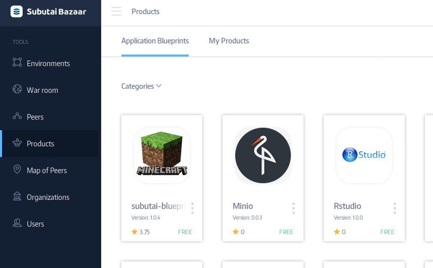
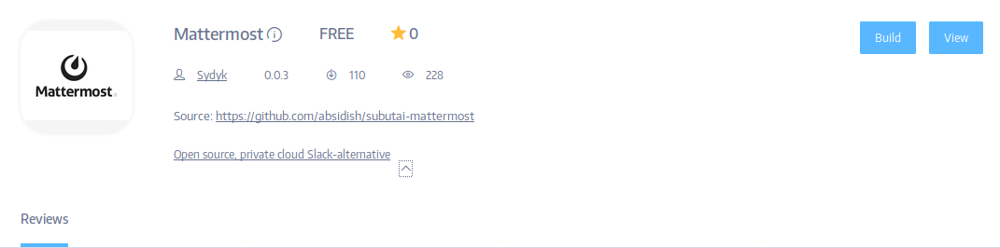
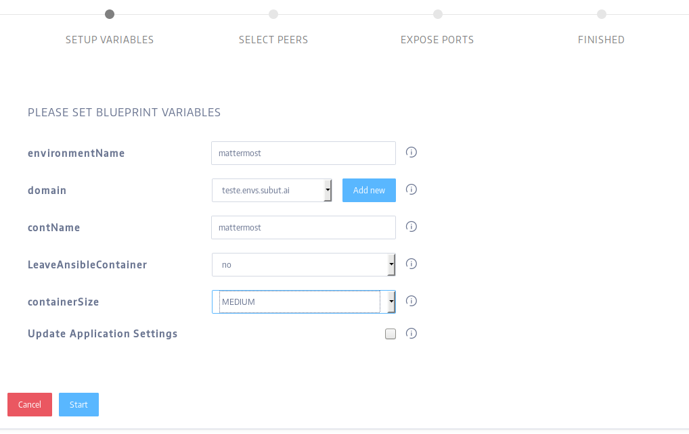
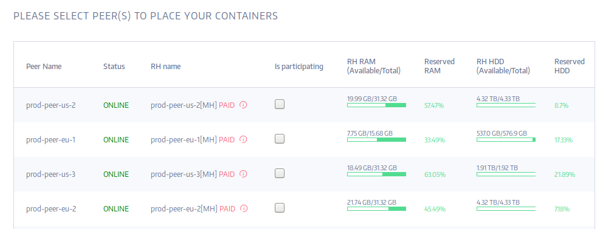
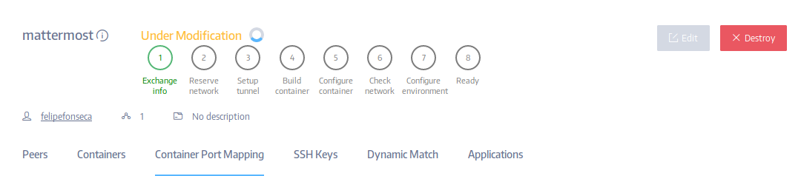
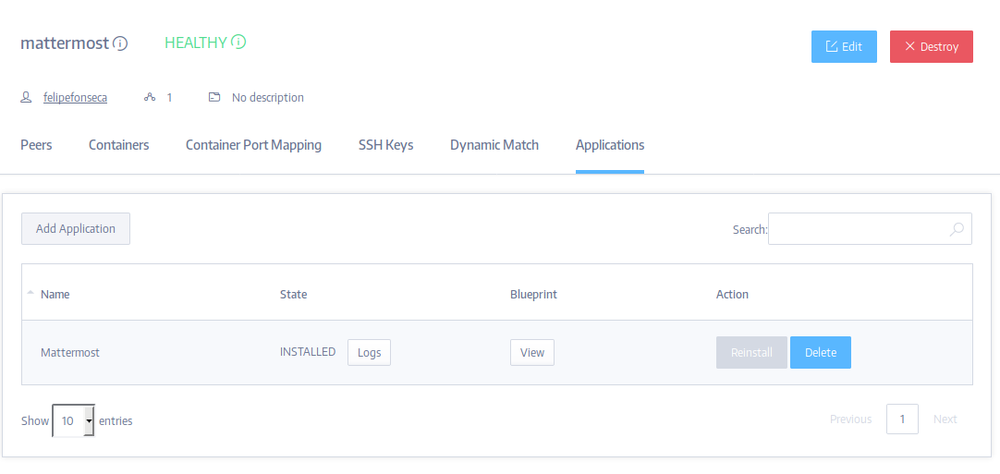

### Using Subutai Blueprints

There are three ways in which you can trigger the installation of an
application blueprint in [Subutai Bazaar](https://bazaar.subutai.io):

1. From the **Products** page
2. From the **GitHub Projects** associated with your profile
3. From an environment's **Applications** tab: the **Add Application**
   button

!!!! **NOTE:** If you want to install into an _existing environment_ you **MUST** use the third option by navigating to an existing environment and adding the application. See [Environment: Applications Tab](#environment-applications-tab).

The different ways to install applications using blueprints are
explained in detail within the following sections.

### Bazaar: Application Blueprints

Authors can publish their application blueprints in the Subutai Bazaar. Users can then directly use these blueprints to create new environments with the blueprint's
application, or add the application to an existing environment. Here's a
screenshot of the Bazaar's products page:

Blueprint authors can _publish_ their application Blueprints on the
Bazaar to be used for free or for some [Subutai™ 
GoodWill](../../using-bazaar/goodwill). All the blueprints are open source so this is for sincerely rewarding good deeds. If you wanted to, you could still fork their
public repository and use the blueprint privately, but why not
contribute back? See the guide on [Writing Subutai
Blueprints](../create-blueprints) to author and publish your own blueprints. Here's a view of the MatterMost blueprint view at the Bazaar once it is selected:

Press the __Build__ button to start up the wizard to build either a new
environment or install into an existing one.

### The Blueprint Wizard

When you select a Blueprint to install an application, a wizard will
guide you through the application installation process. Blueprints can
interact with users through the wizard to get additional information
like a traditional installer. Blueprint authors can use custom
variables to parameterize the installation of the p2p cloud application.
Based on values provided from the user, the installation occurs
differently or configures itself differently. Here's a screenshot of the
wizard while installing MatterMost:

### Initial Peers

When installing a Blueprint application users are presented with an
initial list of peers in which to install their application. These
are peers selected by constraints specified by the application author
who knows about the needs of the application. Don't worry:
you can adapt the environment as you please later on or just select your
own peers which are also displayed. Your own peers, free peers, and your favorite peers will always be made available.

### Application View

Once you kick off the application build in your cloud environment,
you'll be offered the link to the environment in your list of
environments. You'll see the new environment building or the new
application building in an existing environment. Environments have an
**Applications** tab to see the current state of an installing application.

### Application Settings

When you go through the wizard to install an application via Blueprint,
the settings you provide are stored in an area of your user profile
called **Application Settings**. The settings you used are remembered so
the next time you install the application there's less work.

You can navigate to your application settings and manage them through
your profile's [drop down menu](../../using-bazaar/user-menu). The **Application Settings** menu item
will take you there.

### Accessing Containers

Normal users will rarely access the infrastructure installed. But
power users, administrators and others will want direct access to those
environment containers. Owners can deploy SSH public keys into all
containers to enable SSH access via Subutai's P2P protocol.

Users can maintain their SSH public keys on the Bazaar in their user
profile. This is useful because these keys can be automatically deployed
to the environments they create to allow access to containers.

Blueprint authors may specify SSH key name references. This is the name
of a default key in the users profile. If an SSH key by that name is
present, the application requests that it be deployed to all the
containers to allow SSH access. For example, a Blueprint may reference
the **sysadmin** SSH key name. If users have such a key, then the key is
deployed. Obviously the key is different for every user, but the
reference name is the same.

This feature makes it really nice to include Subutai.json files in Open
Source projects in git repositories. Anyone can launch a cloud
application and use their own keys to securely access the containers in
the application's stack even though the key reference is the same.

### GitHub: Private Blueprints

We're getting close into the realm of [Writing Subutai
Blueprints](../create-blueprints), however you don't have to write your own. You can use blueprints others have made even when not yet published on the Subutai Bazaar.

### Fork GitHub Projects

Blueprints are integrated with git. Users can launch blueprints in git
repositories that contain them and the software they're associated with.
This makes for a very nice workflow for developers, and makes it easy
for newcomers to use the application.

Users can fork GitHub projects for example and use the GitHub Projects
in their own user profile to launch those Blueprints. Any project with a Subutai.json in the repository root will be loaded as a private blueprint. If you
like you can publish those blueprints to the Bazaar as well.

Once the project is loaded you can build new environments with the
application or install the application into existing environments. The
Blueprint does **NOT** need to be published at the Subutai Bazaar.

### Environment: Applications Tab

You can launch both public bazaar blueprints and private GitHub
blueprints through an environment's **Applications** tab. There's a
button there, **Add Applications** which opens a dialog that offers
users two categories of application blueprints to select from: published
application blueprints, and private application blueprints.

