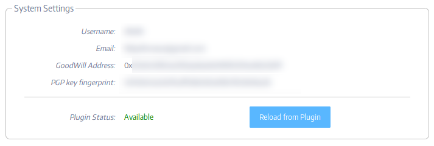

### What is the E2E Browser Plugin?

Subutai uses PGP key pairs to identify all entities, including users like
cloud owners and Peer administrators. The default administrator account
on the new Peer needs to be associated with the global identity of the
Peer owner to share or rent resources to others. The E2E plugin was created to ease the task of managing your PGP key pairs. It is mandatory to access the [Management Console](../../working-with-subutai/using-peerOS/management-console) if you plan to have your own [Peer](../../glossary#Peer), and it is also needed to perform some sensitive operations in the [Subutai Bazaar](https://bazaar.subutai.io), as well as to manage your [GoodWill](../../working-with-subutai/goodwill) wallet.

### How to install the E2E Plugin

To install the E2E browser plugin, simply go to your browser's store, look for the Subutai E2E plugin and install it. You can also use the links below:

   * [Firefox](https://addons.mozilla.org/en-US/firefox/addon/subutai-e2e-plugin/)
   * [Chrome](https://chrome.google.com/webstore/detail/subutai-e2e-plugin/ffddnlbamkjlbngpekmdpnoccckapcnh)
   * For other supported browsers, go to [https://github.com/subutai-io/browser-plugins/releases](https://github.com/subutai-io/browser-plugins/releases). From a particular browser's page, you may search for instructions on installing plugins or extensions.

###  Create your Wallet/PGP keys

1. Go to the E2E plugin options page by clicking its icon in your browser
1. _Note:_ if you already had the E2E plugin installed prior to version 6.x, you may have created a PGP key pair already. If that is so, you will need to _remove the existing keys_ before creating new ones, compatible with the GoodWill wallet. To do that, click the Trash icon associated with each obsolete key.
1. Click the "+ Create" button on the top right corner
1. Insert your email address and desired password, then click "Create". The password is mandatory.
1. Your [GoodWill](../../working-with-subutai/goodwill) wallet and keys are now created. _Do not forget to [back them up](#backup)!_

###  IMPORTANT: Back up your keys/wallet

!! Note: this is mandatory! If you don't have a backup and something happens to your computer, you will not be able to recover the contents of your wallet!

1. Click the corresponding "Export" button on your key
1. Choose a file name (the default one is ok) and insert a password
1. Save the file somewhere safe, and make sure you have at least one copy of this file in places other than this computer

###  Associate your wallet with your account in Subutai Bazaar

1. Log in to the [Subutai Bazaar](https://bazaar.subutai.io)
1. On the top right corner of the Bazaar, click your avatar, then open the "Settings" menu item
1. On "System Settings", Bazaar will check if the version of the E2E plugin installed in your browser is correct
1. To insert/update your PGP and wallet data, click the "Reload from Plugin" button. The E2E plugin will ask for your password, and insert the proper values automatically
1. Click "Save" and you're done

