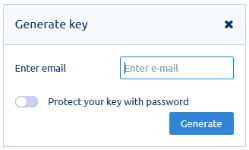

### What is the E2E Browser Plugin?

Subutai uses PGP key pairs to identify all entities, including users like
cloud owners and Peer administrators. The default administrator account
on the new Peer needs to be associated with the global identity of the
peer owner to share or rent resources to others. The E2E plugin was created to ease the task of managing your PGP key pairs. It is mandatory to access the [Management Console](../../working-with-subutai/using-peerOS/management-console) if you plan to have your own [Peer](../../glossary#Peer), and it is also needed to perform some sensitive operations in the [Subutai Bazaar](https://bazaar.subutai.io). 

#### Manually managing PGP keys

Advanced users who know how to manage their own keys can use their preferred
tools to do so. That is only recommended to those who are PGP savvy, understand PKI and know how to secure their keys. Even people expert in PGP will be
annoyed having to deal manually with frequent challenge and
response authorization operations.

This is why we created the browser plugins. The Subutai E2E browser plugins are an alternative to take care of users' PGP keys from end to end. It is installed in your browser and allows you to either upload an existing key, or generate a new pair if you don't have one, directly from the browser window.

### How to install the E2E Plugin

To install the E2E browser plugin:

1. Download and add the E2E plugin for your browser through the links below:
   * [Firefox](https://addons.mozilla.org/en-US/firefox/addon/subutai-e2e-plugin/)
   * [Chrome](https://chrome.google.com/webstore/detail/subutai-e2e-plugin/ffddnlbamkjlbngpekmdpnoccckapcnh)
   * For other supported browsers, go to [https://github.com/subutai-io/browser-plugins/releases](https://github.com/subutai-io/browser-plugins/releases). From a particular browser's page, you may search for instructions on installing plugins or extensions.

    After adding the plugin, you will be prompted to generate the key.  

2. On the Generate key popup, enter your email address, and then click **Generate**.   

   
 
3. On the plugin page, click the  icon to access the key.   

4. In the Fingerprint field of the Main key tab, copy the entire key.

   ✔️ If you are not logged in to Subutai Bazaar, you can do so now to set up the key.
   
   

5. On the Bazaar page, click your account name located at the upper right corner.   

   This displays the Account settings popup.    

   💡 If you have the Set PGP key message displayed, click the link to access Account settings. 

6. On Account settings, paste the PGP key in the PGP Key fingerprint field, and then click **Upload**.   

   The Owner PGP Key field is populated automatically. You must not edit or modify this field.   

7. Click **Save**.    

   💡 If you encounter an error when entering or saving this key, you can delete it from the plugin page, and then generate a new key. You only need one PGP key for your Bazaar account.
