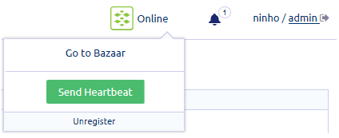

Get to know the features and tools that you can access from each menu option in the Management Console.

#### Console menu
Click a menu option to display the page or the submenu indicated by the down arrow.   

#### Console tools
At the top right corner of the main page are the following account tools and details:   

* **Bazaar status and tools**   
  Additional tools are provided specifically for peers registered with Bazaar. 

  Beside the Bazaar logo, you can see the current status of a registered peer: Online or Offline. Click the Bazaar status or logo to display the submenu.   
  

  * **Go to Bazaar** - Redirects you to the Bazaar site.
  
  * **Send Heartbeat** - Manually sends a heartbeat from your peer to Bazaar to verify that your peer is up and running. A confirmation     message is displayed to notify you of the successful transmission.
  
  * **Register/Unregister**

* **Notifications and logs**   
  The Notification bell with a number indicates the presence of notifications or logs. These notify you of available updates, task status, and change in Console settings or components.

    💡 If you want to view log details, go to System > Updates. 

    Click the bell to display the list of notifications.

