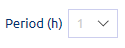

Monitor your components through charts and graphs generated from real-time data. Performance metrics are provided for the CPU, network, memory, and disk of a component.

Use the filters on each tab to select the specific component that you want to view.

* **Peer**  
  On the Peer tab, select the host and period.   
     
  The current P2P status is also displayed beside the filters.   
* **Environment**   
  On the Environment tab, select the environment, container, and period.
     
* **Management**   
  On the Management tab, select a period to view the performance of the Console.   
  
	
Hover over a graph or chart to view actual figures. The following images are from Peer metrics:

CPU - percentage of usage for system and user -- idle, iowait, nice
	
	
Network - incoming (in) and outgoing (out) data transmission metrics 
	

Memory - cache and other RAM metrics

	
Disk - used and total disk space (in GB), with breakdown of usage per directory
	
