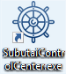
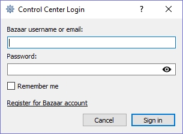
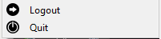

#### Requirements 

Minimum software and hardware requirements

* Available disk space: 150 MB
* Operating system: Windows 10, macOS (OS X El Capitan or higher),  or Linux (Debian based distributions)

#### How to download and install the Control Center

Click [here](https://subutai.io/getting-started.html#companion) to download the latest version of the Control Center for your specific system. Advanced users who might be interested in installing the Master or Developer versions of the Control Center can download them from the same site.

To install:
* For Windows and Mac users, follow and complete the steps in the setup wizard.
* For Linux users, run:    

  `apt install /path/to/subutai-control-center.deb`   

  ✔️ You may use your preferred install method such as `aptitude` or `gdebi`, depending on your system setup.

#### How to access the Control Center

After installing the application, you can access it through the Control Center icon, usually displayed on the desktop.    

On the Login screen, sign in to the Control Center using your credentials for [Subutai Bazaar](https://bazaar.subutai.io). Users without a Bazaar account have to click **Register** first to create one.    

Once logged in, you can click the tray icon from your desktop’s system tray to access the menu.    

There are two ways to exit the Control Center:   

* **Logout** - Logs you out of the Bazaar account. This opens the Login screen, allowing you to use another Bazaar account to access the Control Center.
* **Quit** - Logs you out of the Control Center.    

Both ways allow you to exit without stopping the P2P daemon and peers running in the background. This keeps the connection active between the Control Center and Bazaar. Also, the tray icon is removed. 
