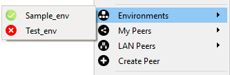
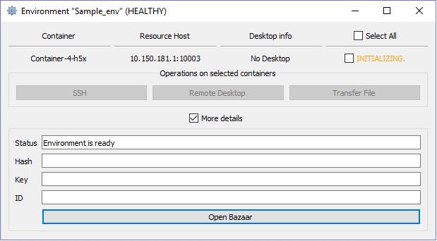
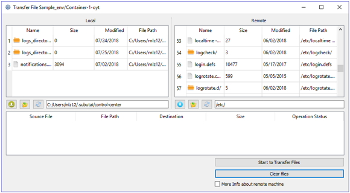
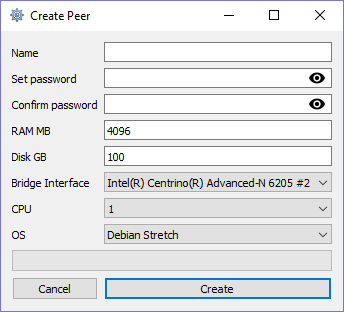
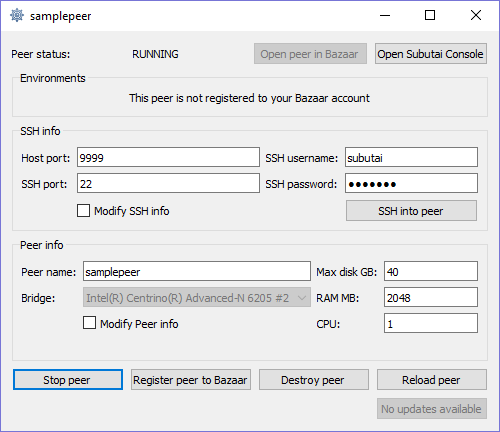
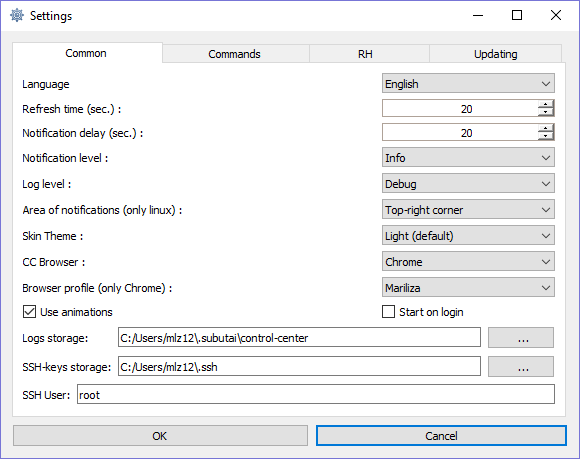
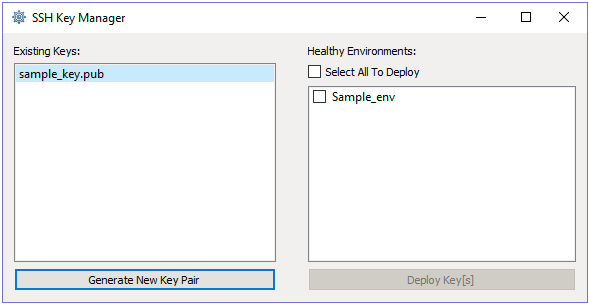
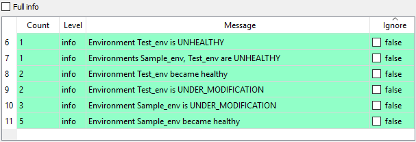
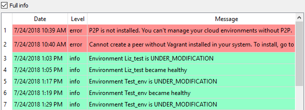
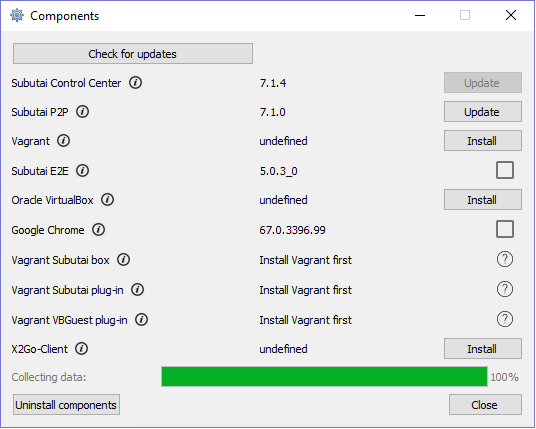

Get yourself familiarized with the Control Center’s user interface to know where to find and how to access its features. 

#### Control Center menu

**P2P** - Displays the current P2P state and the control to start or stop running the P2P daemon. If you have not installed the P2P daemon, you will see the option to do so first.   
**Go to Bazaar** - Launches the Bazaar site on a new Chrome window.   
**Account name** - Displays the name of the logged in Bazaar account. Clicking the name opens Bazaar’s Billing page.   
**Balance** - Displays the current GoodWill balance. Clicking the balance opens Bazaar’s Billing page.   

---------------

**Environments** - Shows environments associated with the logged in Bazaar account.   
**My Peers** - Shows peers associated with the logged in Bazaar account.   
**LAN Peers** - Lists peers from your local network.   
**Create Peer** - Opens the Create Peer screen where you can set up and build new peers.   

---------------

**Settings** - Displays the Control Center preferences that you can change, including language, storage paths, and frequency of updates.   
**SSH-keys management** - Opens the SSH Key Manager where you can add keys or deploy them to your environments.   
**Notifications history** - Displays recent notifications such as installation and event status received from the Control Center and Bazaar.    
**Components** - Displays the list of components that you can install or update, depending on your requirements and system setup.   

---------------

**Help** - Opens the Control Center Help page.   
**Logout** - Logs you out of the Bazaar account and reopens the login screen.    
**Quit** - Exits the Control Center application.    

#### Environments
You can access environments associated with the Bazaar account used to log in to Control Center. From the Environments submenu, you can access the list of environments and view their current state: Healthy, Unhealthy, or Under Modification.

Regardless of its state, you can select an environment from the list to open its management screen. On this screen, you can view the containers, resource hosts, and other related details. The last column shows the container’s current state: Initializing, Connecting, Ready, or Failed. When a container is Ready, you can select it to establish an SSH or remote desktop connection via the X2Go client.

💡 Establishing container connection requires an SSH key.

On the management screen, checking the **More details** box displays the properties of the environment. It also has the **Open Bazaar** button that redirects you to the Containers tab of the Environments page in Bazaar. 

The Control Center has a built-in utility for file transfers, another operation available for containers. You can upload or download files from or to remote containers. On the File Transfer screen, you can select multiple files, and then click the corresponding transfer buttons or just drag and drop.    

#### Peers 
Peer creation through the Control Center is similar to [Quick Install PeerOS](../../../working-with-subutai/using-peeros/peeros-quick-install) procedure. While logged in using the Bazaar account, the Control Center gives access to peers associated with that account. You can still access peers that are not on your local machine, but with limited capabilities.    

The My Peers submenu displays your list of peers and their status: Running peer on local machine, Running peer not on local machine, Peer is under modification, Peer is stopped or not running. After you have registered a peer in Bazaar, additional status options include the following: Registered peer is online, Registered peer is offline. 

From the list, you can select a peer to open its management screen used for viewing or editing peer settings and SSH details. You can also view the current list of environments on a registered peer, if any.    

The management screen provides several controls for peer administration:

💡 Except for Open Peer in Bazaar, the rest of the operations are available only for peers on your local machine.

* **Open Peer in Bazaar** - Opens the peer’s details page in Bazaar.   
* **Open Subutai Console** - Opens the peer’s Subutai or management console. 
* **SSH into peer** - Connects to the peer via SSH. Requires the correct SSH settings to successfully establish a connection.
* **Register peer to Bazaar** - Registers the peer to make it visible to other users in Bazaar.
* **Start/Stop, Destroy, Reload peer** - Use these peer controls accordingly. 
* **Update** - Applies peer updates received by the Control Center.

#### Settings
Preferences and settings for working with the Control Center are displayed and grouped according to the following tabs:

* **Common** - Preferences for language, notifications, browser, logs, and SSH key.
  💡 Take note that after generating an SSH key pair, you must not change the directory anymore. 
* **Commands** - Settings for default paths of components and the terminal to be used by the Control Center.
* **RH**  - Settings for the default resource host configuration, including the port number and credentials.
* **Updating** - Preferences for the frequency of component updates and automatic update.  

To learn how to set or update each of these preferences, see Configure Control Center Settings.   

#### SSH Key Manager
The SSH Key Manager contains the list of your SSH keys from Bazaar or generated through the Control Center. It provides controls for creating keys and deploying them to environments.

* **Existing Keys** - Displays the keys that are stored in your SSH keys directory. The path to this directory is provided in the Settings screen, under the Common tab. Clicking the Generate button creates a new key pair, private key and new .pub file. 
* **Healthy Environments** - Displays the available environments to which you can deploy the SSH keys.

#### Notifications History
Here you can view all notifications for updates received by the Control Center. By default, recent notifications are displayed at the top of the list. The column headings enable sorting of notifications.    

Switching to Full info mode allows you to view all messages, including repeat ones, along with the display or receipt date. It hides the Count and Ignore columns.    

Notification settings such as the frequency and storage can be updated. For instructions, see Configure Control Center Settings.

#### Components
Here you can see list of Control Center components and their versions for installation or update. Updates are checked automatically upon launching the Components screen. You can manually invoke the Control Center to get updates by clicking the **Check for updates** button at the top of the screen.    

