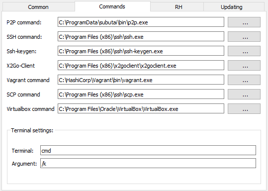
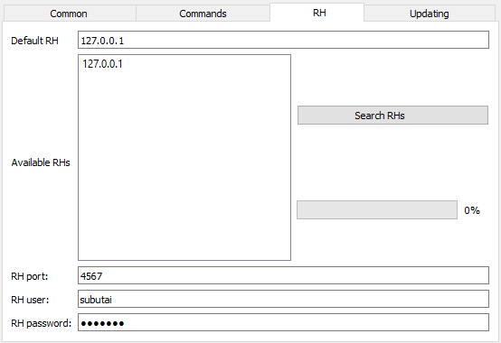
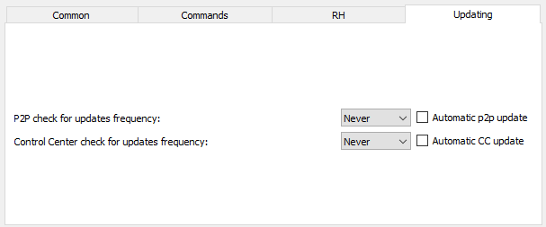
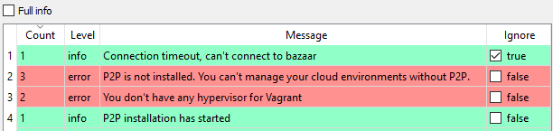
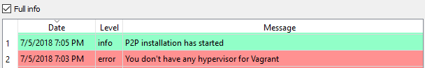

Options for settings and working with the Control Center can be configured on the Settings screen. Preferences related to notification views are specified on the Notifications history screen. 
* [Preferences on Settings screen](#preferences-settings)
* [Preferences on Notifications history screen](#preferences-notifications)

####  Preferences on Settings screen
On the Settings screen, you can configure Control Center settings and preferences on the following tabs:

##### Common or General Settings
   
* General and user interface preferences:   
  * Language, Skin Theme, Use animations - Specify your preferences for the language and look-and-feel of the interface.
  * Area of notifications (for Linux) - For Linux users, select the area of your screen where you want to display notifications.
  * Autostart CC - Check this box if you want to automatically start the Control Center upon logging in to your computer. 
  * CC Browser - Sets the Chrome browser as the default for the Control Center.
  * Browser profile (only Chrome) - Select the default profile or user for the Chrome browser.
* Update and notification settings
  * Refresh time - Adjust the timeout, in seconds, for refreshing the P2P connection status. 
  * Notification delay - Specify how long, in seconds, you want the Control Center to display a notification on your screen.
  * Notification level - Select the type of notification: Info, Error, Warning, Critical error.
* Log settings
  * Log level - Select the level of logs that is written and displayed: 0-Debug, 1-Info, 2-Warning, 3-Critical, 4-Fatal, 5-Disabled. For example, selecting level 2 means that logs of lower levels are not considered anymore.    
  💡 Subutai recommends that you choose level 0-Debug because these logs are very useful for bug fixing.  
  * Logs storage - Specify the full path to the folder where log files are saved. Click the ellipsis button to browse and select the folder.
* SSH key settings
  * SSH keys storage - Specify the full path to the folder where generated SSH key pairs are stored. Click the ellipsis button to browse and select the folder.
  * SSH User - Enter the user to be used in SSH to container sessions.	

##### Commands

* View or specify the full path to the folder where the binaries or executables to the following are located: P2P, SSH, SSH-key gen, X2Go Client, Vagrant, SCP, and VirtualBox. Click the ellipsis button to browse and select the folder. 
* Configure the settings of the terminal that you want Control Center to use: Terminal (defaults to cmd) and Argument (defaults to /k).

##### Resource hosts

The default settings for the resource host are assigned during peer creation. You can change them as needed. 
* Default RH - View or enter the IP address of the resource host that you want to assign as default. 
* Available RHs - Displays the list of available resource hosts that you can assign as default.   
✔️ Click **Search RHs** to look for resource hosts in your local network. This refreshes and updates the Available RHs list. 
* RH port - View or enter the port number of the default resource host. 
* RH user/password - View or enter the username and password for the resource host. These credentials are used when you want to access the peer through the Control Center or the Subutai Console. For more information, see [Configure and Manage Peers](../../control-center/configure-manage-peers). 

##### Updating

View or specify the frequency of checking updates for the Control Center and P2P Daemon.
* Select a frequency option such as Never or Daily, or select the time in hours or minutes. 
* Perform automatic updates by checking the **Automatic** box next to the component. The Control Center will start an update as soon as it has been verified that one is available.

####  Preferences on Notifications

On the Notifications history screen, you can set your view preference:

* **Default view** - When the **Full info** box is not checked, the table displays the instance count, notification level, message, and Ignore option. 	  
    
Under the Ignore column, check the **true** or **false** box next to a message to hide or display it, respectively. Notifications remain on display for seven days and are automatically removed after this period. You may still access notification logs from the storage folder. 
* **Full info view** - When you check the Full info box, the date, notification level, and message are displayed.   
   
For more information about Notifications history, see [Get to Know the Control Center](../../control-center/get-to-know).
