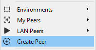
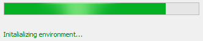
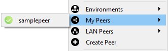

Before creating a peer from the Control Center, be sure to download the components for handling and managing of peers. For advanced users who prefer manual peer creation, you may refer to the quick install or advanced install guides. Peer creation through the Control Center uses the same requirements and settings as the [quick install](../../../working-with-subutai/using-peeros/peeros-quick-install/virtualbox) method.

To create a peer from the Control Center:

1. From the menu, go to Create Peer.
   

2. On the Create Peers screen, enter the following details:
   * Name: Enter a unique name for the peer.
   * Password: Enter a password to use within the Control Center.
   * RAM MB: Enter a value of at least 2048 MB.
   * Disk GB: Enter a value of at least 40 GB.
   * Bridge interface: Select from the available options on your machine.
   * CPU: Select the number of CPU cores. 
   * OS: Debian Stretch

3. Click **Create**.   
   Check the status of peer creation on the progress bar at the bottom of the screen.
   
	
4. Once peer creation is completed, you are prompted to press **ENTER** on the terminal to confirm. 

5. Now that you have a new peer, you can start running it when you’re ready. 
   

   For instructions and to learn about other features such as registering peers with Bazaar, see [Configure and Manage Peers](../../control-center/configure-manage-peers). 
