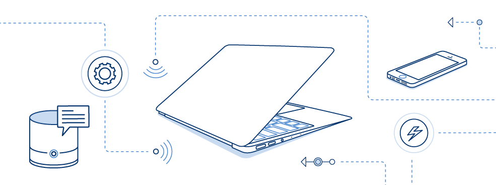

##OptDyn Embraces Google App Engine™ Model With Native AppScale™ Integration {.postTitle-page}

**World’s first secure social Cloud infrastructure platform provides Peer-to-Peer Platform as a Service Cloud layer.**

===

**New York, NY --11 April 2016--** OptDyn announced today the integration of Subutai, its flagship Peer-to-Peer (P2P) infrastructure Cloud computing product, with AppScale, makers of the popular Open Source implementation of Google App Engine (GAE).

The integration will promote the development and proliferation of P2P GAE/AppScale based Cloud applications on Subutai, the world’s first Linux container-based P2P Cloud infrastructure platform that allows anyone to share, barter, or rent compute resources.

**The Peer-to-Peer Panacea**

"P2P is all about sharing, a social activity, which has its advantages, even in small groups," said Alex Karasulu, CEO of OptDyn. "Social Cloud Computing - sharing computing on a mass scale where users contribute resources - will have a profound impact on the way we use the Internet."

With Subutai, users can instantly create and manage virtual data centers using peer resources on local area networks and across the Internet. Any computer or group of computers running Subutai software may choose to expose and share resources to support P2P Cloud environments, with service redundancy built into the platform. In turn, this enables cheap commodity computers and even residential Internet lines to be used to host stable yet extremely adaptive P2P Cloud environments that can change shape and move across the Internet adapting to any global load distribution.

**Millions of Connection Opportunities**

Google App Engine (GAE) is the most popular application Platform-as-a-Service (aPaaS) in the world, with over 6 million active applications. Google uses App Engine to build its internal applications and made the service available to the public in 2008. Rated by Gartner as "one of the more mature aPaaS offerings", GAE is the quickest, most efficient way to create scalable Web applications and mobile backends, providing quicker minimum viable
products (MVPs) and allowing developers to focus on the business logic of their apps instead of the software stack. Google App Engine customers include SnapChat, Spotify, Disney, Rovio, Khan Academy, Best Buy, Sony, and Coca-Cola.

**Enter AppScale**

AppScale is the Open Source implementation of Google App Engine. Endorsed by Google, AppScale leverages the brilliant App Engine model, with the added flexibility to run applications anywhere that is best suited for one’s business. Whether on-premise or in any public Cloud, AppScale makes applications completely portable and Cloud agnostic. AppScale is a popular, go-to choice for app developers as it provides all the benefits of GAE’s rapid development model plus the ability to integrate with existing infrastructure without application modification.

**Bridging the Internet of Things**

Subutai lets ordinary people socially share, or rent computers commercially to create Cloud environments while attaching whatever devices are around and available to them, optimally integrating the Cloud with the Internet of Things (IoT).

Together, Subutai and AppScale empowers developers by automatically making any GAE application a P2P distributed Cloud application. In addition to the convenience of forming P2P Cloud environments on demand to develop GAE applications, new opportunities arise for the consumption of applications where end users may simply drag and drop GAE applications into their own P2P Cloud environments.

"AppScale integration with Subutai adds a new dimension to our platform," said Woody Rollins, CEO of AppScale Systems. "P2P Cloud computing blends the lines between public, private, and hybrid Cloud computing. AppScale’s customers come to us because they love the Google model but their business requires a more flexible deployment solution.  Subutai provides a whole new avenue of options. We are very excited about this collaboration and the potential of Subutai."

Subutai users connect from all over the globe to share resources and create secure Cloud environments across their peers. Just as a cloud can float down onto land and is thus called fog, IoT devices attach to a Cloud when available and needed as it floats onto the periphery (a.k.a. “Fog computing”).

“With Subutai P2P Cloud computing, the term ‘elasticity’ has a whole new meaning by freeing the Cloud from the confines of the datacenter,” added Karasulu. “Your next personal computer won't be just another laptop, tablet, or wearable device: it will be EVERYTHING surrounding you, connected fluidly by adaptive P2P Clouds driven by social interaction. We’re very excited about the opportunities ahead.”

**Open Source at the Core**

The complete Subutai system, including AppScale, is rooted in Open Source, and leverages the power of dozens of ubiquitous enterprise-quality projects that include: Apache Cassandra, Apache Hadoop, Linux, OpenGPG, Apache Solr, Apache Spark, Ubuntu Snappy, among many others. Subutai software (excluding code for The Bazaar) is Open Source under Apache License v2, and available at [github.com/subutai-io](https://github.com/subutai-io).

**Opening Beta Program**

OptDyn will soon be broadening its beta program for Subutai. Users interested in applying for the beta program can register at [bazaar.subutai.io](https://bazaar.subutai.io). The company anticipates formal launch of the full Subutai system mid-2016.

**About AppScale Systems, Inc.** AppScale, based in California, is an open source implementation of Google App Engine, the most popular application development platform in the world. With AppScale, developers can rapidly prototype and create apps quickly and efficiently, with the freedom to run their applications wherever it makes the most sense for their business. Some of AppScale's customers include The World Wildlife Fund (WWF), Natixis Global Asset Management, Chico's FAS and BetterCloud. AppScale Systems is endorsed by Google and is a Google Cloud Technology Partner. AppScale CEO Woody Rollins was also co-founder and founding CEO of Eucalyptus, the private cloud pioneer acquired by HP. For more information, please visit: [appscale.com](http://www.appscale.com)

**About OptDyn, LLC**

Established in 2013, OptDyn provides the world’s first secure social Peer-to-Peer computing solutions across dynamic Cloud infrastructures and the Internet of Things. The company’s easy-to-deploy Subutai system includes: Subutai (container-based P2P Cloud infrastructure platform that allows anyone to share, barter, or rent compute resources); Subutai Bazaar (social Cloud computing exchange, reputation system, and search engine for finding peers and resources); and Subutai Router (hardware optimized, dynamically reconfigurable Broadband Router and IoT gateway device that accelerates propagation across unstable residential Internet lines). OptDyn is based in New York with a distributed team located in Europe and Asia. For more information, visit [optdyn.com](https://optdyn.com/) and follow [@optdyn on Twitter](https://twitter.com/optdyn).

"Subutai”, “Subutai”, “Subutai Bazaar”, and “Subutai Router” are trademarks of OptDyn, LLC. “AppScale” is a trademark of AppScale Systems, Inc. “Google” and “Google App Engine” are trademarks of Google Inc. All other company and product names may be trademarks of the respective companies with which they are associated.

Sally Khudairi 
OptDyn 
[sk@optimal-dynamics.com](mailto:sk@optimal-dynamics.com) 
+1 617 921 8656
